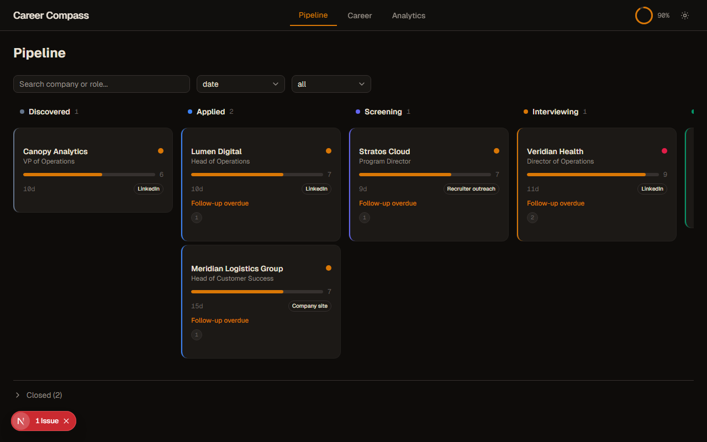
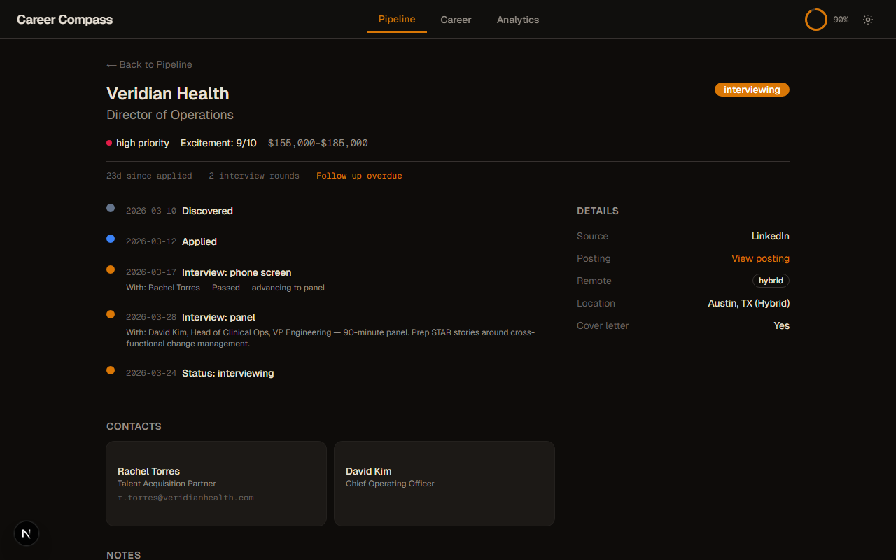
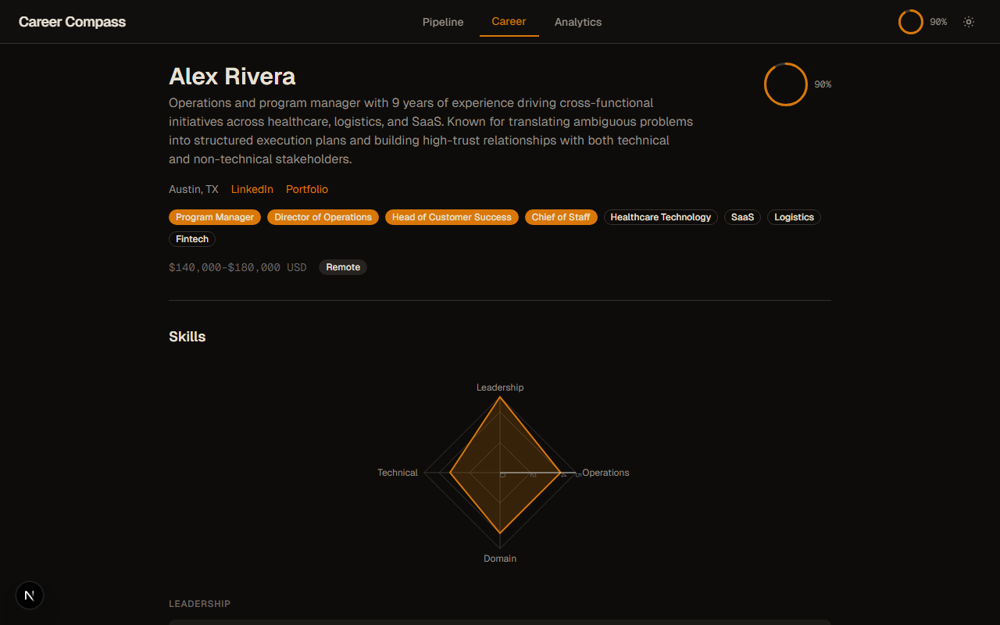
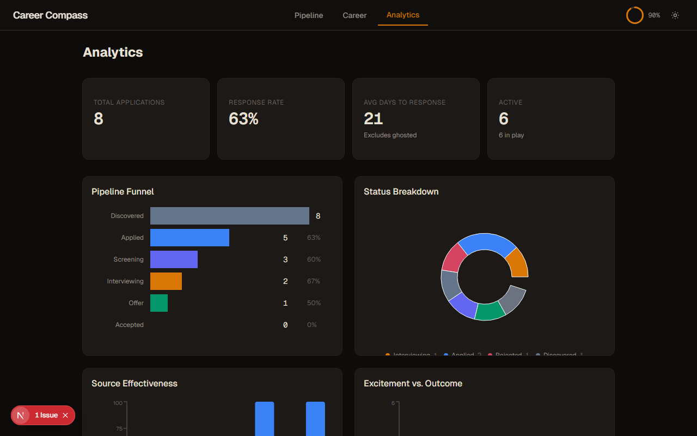

# Career Compass MCP

[](LICENSE)
[](https://www.npmjs.com/package/career-compass-mcp)
[](https://nodejs.org)
[](https://modelcontextprotocol.io)

**Your AI-native career co-pilot, built for Claude.**

Career Compass turns Claude into a full job-search partner — one that knows your entire career history, tailors every resume and cover letter, tracks every application, and preps you for every interview. Initiate via conversation, onboard, and track multiple applications in moments.

---

## Your data stays on your machine

Career Compass is local-first. Your career history lives in plain YAML files on your own disk, under the directory you point `CAREER_DATA_PATH` at (default `~/.career-compass`). There is no account, no cloud sync, and no telemetry — nothing phones home.

Your real data is never committed to git: the `.gitignore` excludes `data/career/` and `data/pipeline/`, so the only career data in this repo is the fictional sample under `data/example/` (meet Alex Rivera). Read it, edit it, delete it — it's all just files you own. And nothing real ever ships in the npm package — a publish-time guard (`npm-pack-leak-guard`) scans the exact tarball and fails the publish if any real-career marker appears.

---

## What it feels like

```
You: I have a panel interview at Veridian Health on Friday — Director of Operations role.
     Can you prep me?

Claude: On it. Reading your career history now...

     [Generates 90-second pitch, 8 STAR stories matched to likely panel questions,
      company research brief, 10 questions to ask them, and a list of watch-outs
      based on gaps in your background — all in one response]
```

```
You: Here's a job posting I just found. [pastes posting]
     How well do I fit?

Claude: Fit score: 8.1/10. Here's why — and here's what they'll probe you on...

     [Returns matched strengths, honest gap analysis, talking points in their language,
      and a "day in the life" of what the role actually looks like]
```

```
You: Show me what needs attention in my pipeline today.

Claude: 3 things:
     - Meridian Logistics follow-up is overdue (8 days since you applied, referral from Marcus Chen)
     - Veridian panel is Friday — prep above
     - Novare rejection arrived — want me to draft a keep-the-door-open response?
```

---

## Architecture

```
┌─────────────┐         ┌──────────────────────────────────────┐
│             │  MCP     │         MCP Server (Node.js)         │
│   Claude    │◄────────►│                                      │
│             │  stdio   │  Tools ─── Resume, Pipeline, Interview│
│             │         │  Resources ─ Career KB, Pipeline data │
└─────────────┘         │  Prompts ── Power-user shortcuts      │
                        │                                      │
                        │         ┌──────────────┐             │
                        │         │  File Store   │             │
                        │         │  (YAML files) │             │
                        │         └──────┬───────┘             │
                        └────────────────┼─────────────────────┘
                                         │ reads
                        ┌────────────────┼─────────────────────┐
                        │   Dashboard    │    (Next.js)         │
                        │                ▼                      │
                        │  Pipeline Kanban · Career KB Overview │
                        │  Analytics · Onboarding Wizard        │
                        └──────────────────────────────────────┘
```

---

## Your data stays on your machine

Career Compass is local-first by design. Your real career data — résumé history, the
companies you're talking to, salary numbers, interview notes — lives in **plain YAML
files on your own disk** and never leaves it.

- **Where your data lives:** `~/.career-compass/` by default (override with the
  `CAREER_DATA_PATH` environment variable). This directory is created and read on *your*
  machine. It is **never** uploaded anywhere, and it is **not** part of this npm package.
- **What ships in the package:** only the MCP server code and a small set of **fictional
  example files** (`data/example/` — the "Alex Rivera" persona). There is no real career
  data in the published package, and none can be — the package and your data live in
  different places, and the publish-time leak guard enforces it.
- **The dashboard reads your data at request time, locally.** The Next.js routes are
  `force-dynamic`, so the dashboard server reads your YAML *when you open a page*, from a
  server running on your own `localhost`. Your data is **never baked into a build**, never
  prerendered into static HTML, and never sent over the network. *(There's a regression
  test, `standalone-dynamic.test.ts`, that guards exactly this.)*
- **No telemetry.** Career Compass makes no analytics or phone-home calls. The only thing
  that ever sees your career data is the Claude conversation *you* start, through the MCP
  server *you* run.

In short: this is a tool you run, on your machine, over your files. Treat
`~/.career-compass/` like any private notebook — back it up, don't commit it to a public
repo, and it stays yours.

---

## Quick Start

Career Compass is on npm — point Claude straight at it, no clone or build required.

### 1. Add to Claude

Add this to your `~/.claude.json` (Claude Code) or equivalent MCP config:

```json
{
  "mcpServers": {
    "career-compass": {
      "command": "npx",
      "args": ["-y", "career-compass-mcp"],
      "env": {
        "CAREER_DATA_PATH": "/Users/you/career-data"
      }
    }
  }
}
```

`npx -y career-compass-mcp` fetches and runs the latest server on demand. Point
`CAREER_DATA_PATH` anywhere you like — Career Compass initializes the directory on first
run. Leave it unset to use the default, `~/.career-compass`.

Prefer a global install? Run `npm install -g career-compass-mcp`, then set
`"command": "career-compass-mcp"` with no args.

### 2. Onboard (first conversation)

Open Claude and say:

> **"Set up my Career KB. Here's my resume:"** [paste your resume]

Claude will:
- Extract your work history, achievements, and skills into structured YAML
- Ask clarifying questions about gaps or unclear metrics
- Save everything to your `CAREER_DATA_PATH`

That's it. From there, every tool has full context on who you are.

---

## Data structure

Career Compass stores all data as YAML files under `CAREER_DATA_PATH` (default `~/.career-compass`):

```
~/.career-compass/
├── career/
│   ├── profile.yaml        # who you are, what you're targeting
│   ├── experience.yaml     # roles, achievements (metrics + context + impact)
│   ├── skills.yaml         # skills with proficiency and recency
│   ├── education.yaml      # degrees, certifications, coursework
│   ├── projects.yaml       # portfolio projects
│   └── testimonials.yaml   # quotes and recommendations
└── pipeline/
    └── applications.yaml   # all job applications
```

This is your single source of truth — built once, enriched over time, read by every tool. You never need to edit these files by hand: use `ingest_document` to add data by pasting documents, or just ask Claude to update specific sections.

See [`data/example/`](data/example/) in this repo for a fully populated sample (the fictional Alex Rivera).

---

## Dashboard

v2.0 includes a local web dashboard — a visual layer on top of your Career KB and pipeline data. Open it alongside Claude or use it standalone to review and manage your search.






Four views:

**Pipeline kanban board** — All your applications laid out by stage (Exploring → Applied → Screening → Interviewing → Offer → Closed). Drag to advance stages. See stale applications at a glance. Click any card to drill in.

**Application detail view** — Full timeline for a single application: every status change, contacts associated with the role, notes from conversations, and next action. Everything Claude knows about that opportunity in one place.

**Career KB overview** — Visual summary of your career data: skills radar (proficiency × recency), experience timeline, testimonials, and a completeness indicator showing what Claude has to work with. Useful for spotting gaps before you onboard a new role.

**Analytics** — Funnel conversion rates, response rates by source, time-in-stage averages, and source effectiveness. See which channels are actually working.

### Running the dashboard

>**Two dashboards ship now.** A built-in **lite dashboard** (zero-build, pure HTML) is bundled
> in the npm package and starts automatically when the full dashboard isn't built - so
> `career-compass-mcp dashboard` always works. The **full dashboard** (Next.js: kanban drag,
> analytics, Career KB views, onboarding wizard) still runs from a source build:

```bash
git clone https://github.com/benskamps/career-compass-mcp.git
cd career-compass-mcp
npm install
npm run build

# Try it with the bundled Alex Rivera sample (no setup, ~1 minute):
CAREER_DATA_PATH=data/example npm run dashboard
```

This opens the dashboard at `http://localhost:3141` (or the next available port). Point
`CAREER_DATA_PATH` at your own data directory to use it for real. The onboarding wizard
walks you through job targets, salary expectations, and confirming your skills inventory —
the gaps a resume doesn't naturally contain.


### Lite dashboard (zero-build)

Don't want to build the Next.js app? The **lite dashboard** ships inside the npm package and
needs no build step. It's a single self-contained HTML page - pipeline KPIs, a kanban board by
stage, a next-actions panel (overdue follow-ups, upcoming interviews, expiring offers), and a
stage-distribution chart - served by a dependency-free Node server that **re-reads your YAML on
every request**, so a browser refresh always reflects the current state of `~/.career-compass`.

```bash
# Ships in the package - no clone, no build:
npx -y career-compass-mcp dashboard --lite

# Or try it against the bundled Alex Rivera sample:
CAREER_DATA_PATH=data/example npx -y career-compass-mcp dashboard --lite
```

Plain `career-compass-mcp dashboard` uses the full dashboard when it's been built and falls back
to the lite one otherwise. Data never leaves your machine - the page has no external assets and
makes no network calls. Clicking a card copies a ready-to-paste prompt for Claude (in Cowork, the
same board is available as a live artifact that dispatches the prompt straight into chat).

---

## Tools

| Tool | What it does |
|------|-------------|
| `explore_opportunity` | Analyzes a job posting against your Career KB — fit score, matched strengths, gaps, talking points, day-in-the-life, red flags |
| `research_company` | Builds an intelligence brief: product, culture, funding, interview process, strategic fit |
| `tailor_resume` | Generates an ATS-optimized, tailored resume from your KB — standard, federal, academic, or functional formats |
| `generate_cover_letter` | Writes a personalized cover letter with your actual achievements woven in |
| `format_for_ats` | Reformats resume content for specific ATS systems: Workday, Greenhouse, Lever, LinkedIn, iCIMS, Taleo |
| `manage_pipeline` | Tracks applications from discovery through offer — add, update, list, stats, next actions |
| `classify_email` | Classifies a job-search email and extracts contacts, dates, and suggested pipeline updates |
| `prepare_interview` | Full interview prep: opening pitch, STAR stories, likely questions, company alignment, questions to ask |
| `evaluate_offer` | Breaks down total comp, compares to market, builds negotiation strategy, drafts counter scripts |
| `ingest_document` | Extracts achievements from any document: performance review, award email, LinkedIn recommendation, project summary |
| `generate_rejection_response` | Drafts a graceful response that keeps the door open and maintains the relationship |

## Resources

Claude can read these directly (e.g., "read my career profile"):

| Resource | URI | Contents |
|----------|-----|----------|
| Career Profile | `career://profile` | Name, contact, summary, targets, preferences |
| Work Experience | `career://experience` | Full history with achievements |
| Skills Inventory | `career://skills` | Skills with proficiency and recency |
| Projects | `career://projects` | Portfolio with outcomes |
| Education | `career://education` | Degrees, certifications, coursework |
| Testimonials | `career://testimonials` | Quotes, recommendations |
| Full KB | `career://full` | Everything above in one read |
| Pipeline | `career://pipeline` | All applications with status |

## Prompts

Power-user shortcuts (appear in Claude's prompt menu):

| Prompt | What it does |
|--------|-------------|
| `resume-tailor` | Drop in a posting → get a tailored resume |
| `interview-coach` | Company + role + interview type → full prep package |
| `negotiation-coach` | Paste an offer → get analysis, strategy, and counter scripts |

---

## Configuration

| Env var | Default | Description |
|---------|---------|-------------|
| `CAREER_DATA_PATH` | `~/.career-compass` | Directory where your career and pipeline YAML files are stored |

---

## Building from Source

```bash
git clone https://github.com/benskamps/career-compass-mcp
cd career-compass-mcp
npm install
npm run build
```

`npm run build` compiles both the MCP server (TypeScript → `build/`) and the Next.js dashboard (`dashboard/.next/`). To work on just the MCP server, use `npm run build:mcp`. For dashboard development with hot reload, use `npm run dev:dashboard`.

Then point your MCP config to `node /path/to/career-compass-mcp/build/src/index.js` (or just use the published package via `npx -y career-compass-mcp`).

Use `npm run dev` during development — TypeScript watch mode recompiles on save.
Use `npm run inspect` to open the MCP Inspector (web UI for testing tools interactively).

---

## Why Career Compass

Job searching is one of the highest-stakes, most document-intensive activities most people do — and most tools treat it as a data entry problem. Spreadsheets for tracking. Templates for resumes. Generic advice for interviews.

Career Compass treats it as a knowledge problem. Your career history is a corpus. Every application is a retrieval and synthesis task. Every interview is a pattern-matching problem against a known dataset (the posting) and a known corpus (your KB).

The Career KB is your single source of truth — built once, enriched over time, and used by every tool. A tailored resume draws from it. Interview prep draws from it. Cover letters draw from it. The pipeline tracks against it. Nothing gets lost because it's never in a tab you'll close.

---

## Development

```bash
git clone https://github.com/benskamps/career-compass-mcp.git
cd career-compass-mcp
npm install
cd dashboard && npm install && cd ..

# MCP server (TypeScript watch)
npm run dev

# Dashboard (Next.js + Turbopack)
npm run dev:dashboard

# MCP Inspector (test tools interactively)
npm run inspect

# Tests
npm run test:mcp        # MCP server tests
npm run test            # Dashboard tests

# Storybook (component library)
npm run storybook

# Use example data for development
CAREER_DATA_PATH=data/example npm run dev:dashboard
```

---

## Contributing

Issues and PRs welcome. If you add a new tool, register it in `src/server.ts` and follow the pattern in any existing tool file — each tool returns a structured prompt that Claude acts on with the full KB in context.

---

## License

MIT

---

*Part of the [Brokenbranch Lab](https://www.brokenbranch.dev/lab/) — Ben Schippers' workshop of AI-native tools and research.*
