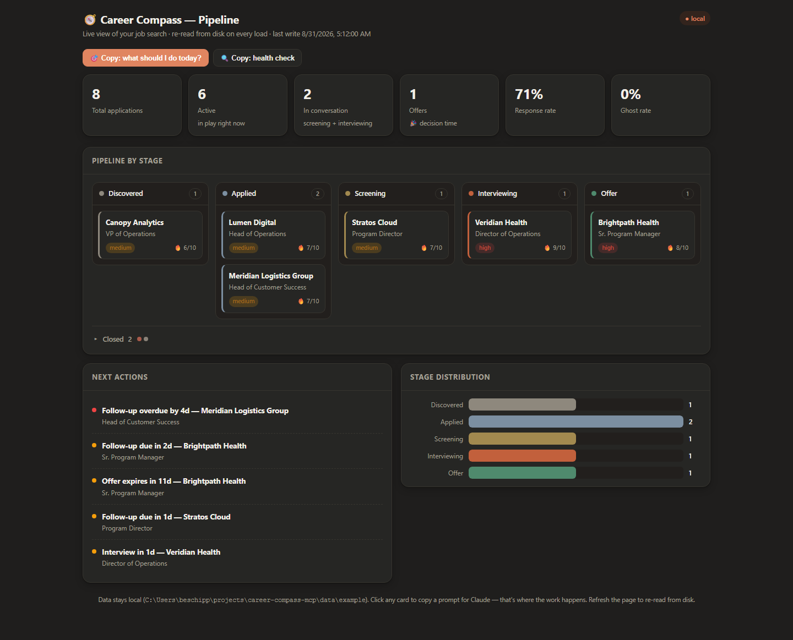
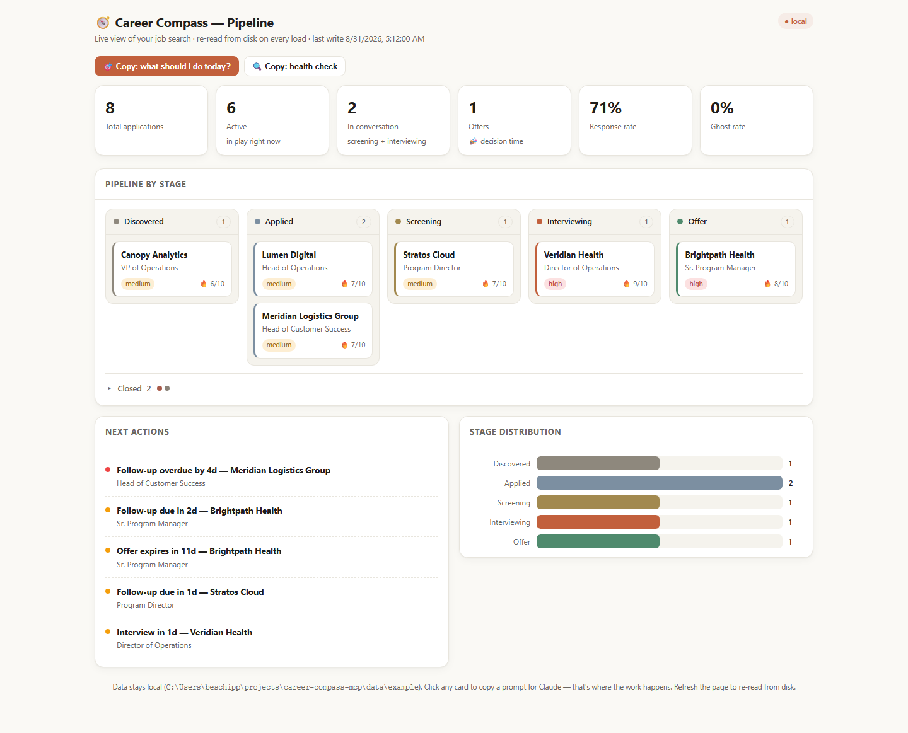

# Career Compass

[](https://www.npmjs.com/package/career-compass-mcp)
[](https://www.npmjs.com/package/career-compass-mcp)
[](LICENSE)
[](https://nodejs.org)
[](https://modelcontextprotocol.io)

**An AI-native career co-pilot for Claude.**

Career Compass gives Claude your entire career history as a working corpus — then uses it
to tailor every résumé, track every application, prep every interview, and pressure-test
every offer. One conversation that never forgets what you have done.

Your data is plain YAML on your own disk. No account, no cloud sync, no telemetry.



**See it in 10 seconds.** No install, no config, no data of your own required:

```bash
npx -y career-compass-mcp dashboard --sample
```

That opens the screenshot above in your browser, running against a fictional job search
bundled with the package. It is read-only — nothing is written, and nothing leaves your
machine.

---

## What it feels like

```
You: I have a panel interview at Veridian Health on Friday — Director of Operations role.
     Can you prep me?

Claude: On it. Reading your career history now...

     [Generates 90-second pitch, 8 STAR stories matched to likely panel questions,
      company research brief, 10 questions to ask them, and a list of watch-outs
      based on gaps in your background — all in one response]
```

```
You: Here's a job posting I just found. [pastes posting]
     How well do I fit?

Claude: Fit score: 8.1/10. Here's why — and here's what they'll probe you on...

     [Returns matched strengths, honest gap analysis, talking points in their language,
      and a "day in the life" of what the role actually looks like]
```

```
You: Show me what needs attention in my pipeline today.

Claude: 3 things:
     - Meridian Logistics follow-up is overdue (8 days since you applied, referral from Marcus Chen)
     - Veridian panel is Friday — prep above
     - Novare rejection arrived — want me to draft a keep-the-door-open response?
```

---

## Install

Pick your client. Every route runs the same server, and none of them needs a clone or a
build.

### Claude Code

One command:

```bash
claude mcp add career-compass -s user -- npx -y career-compass-mcp
```

`-s user` installs it for every project rather than just this one. Confirm it landed with
`claude mcp list`.

To keep your career files somewhere other than the default `~/.career-compass`:

```bash
claude mcp add career-compass -s user -e CAREER_DATA_PATH=/path/to/career-data -- npx -y career-compass-mcp
```

### Claude Desktop

**The extension bundle is the short way.** Download the `.mcpb` file from the
[Releases page](https://github.com/benskamps/career-compass-mcp/releases/latest), then in
Claude Desktop go to **Settings → Extensions** and install it. There is no JSON to edit and
nothing to install first. Set `CAREER_DATA_PATH` in the extension's own settings if you
want your files somewhere other than `~/.career-compass`.

The bundle does not self-update: to upgrade, download the newer `.mcpb`, remove the
installed extension, and install the new file. Note your data path before removing it —
settings are re-entered on install, and `check_setup` prints the path.

**Or point Claude Desktop at npx.** Open **Settings → Developer → Edit Config**, or edit
the file directly:

| OS | Config file |
|----|-------------|
| macOS | `~/Library/Application Support/Claude/claude_desktop_config.json` |
| Windows | `%APPDATA%\Claude\claude_desktop_config.json` |
| Linux | `~/.config/Claude/claude_desktop_config.json` |

Add the server:

```json
{
  "mcpServers": {
    "career-compass": {
      "command": "npx",
      "args": ["-y", "career-compass-mcp"]
    }
  }
}
```

Restart Claude Desktop. To choose your own data directory, add an `env` block alongside
`args`:

```json
"env": { "CAREER_DATA_PATH": "/Users/you/career-data" }
```

### Any other MCP client

Cursor, Windsurf, Zed, Cline, Continue and friends all take the same shape — a stdio server
with `command: "npx"` and `args: ["-y", "career-compass-mcp"]`. Drop that into whatever the
client calls its MCP config.

### Prefer a global install

```bash
npm install -g career-compass-mcp
```

Then use `"command": "career-compass-mcp"` with no `args`, or
`claude mcp add career-compass -s user -- career-compass-mcp`.

### Confirm it worked

Ask Claude:

> **"Run the Career Compass setup check."**

That calls `check_setup`, which reports your version against the current npm release, where
your data directory is, which Career KB sections are filled in, whether your pipeline
parses, and whether the dashboard is running — each finding with the one command that fixes
it. It is read-only, so it runs without a permission prompt.

---

## Your first conversation

Open Claude and say:

> **"Set up my Career KB. Here's my résumé:"** [paste your résumé]

Claude will extract your work history, achievements, and skills into structured YAML, ask
clarifying questions about gaps or vague metrics, and call `save_career_section` once per
section to write it to disk.

`save_career_section` is where your data actually lands — it is the only tool that writes
the Career KB. It saves one section at a time (`profile`, `experience`, `skills`,
`education`, `projects`, `testimonials`), validates against the schema before touching the
file, and keeps the previous version as a timestamped `.bak`. Because it replaces a section
wholesale, your client will ask you to confirm each write; approving them is what fills the
KB.

That is the whole setup. From there every tool has full context on who you are, and the KB
compounds — each posting you explore, interview you debrief, and offer you weigh can add a
dated signal back to it.

**Already have material lying around?** Performance reviews, award emails, recommendations,
old project write-ups — paste any of them and ask Claude to pull the achievements out. That
is `ingest_document`. It reads and extracts but never writes; `save_career_section` is still
what puts the results on disk.

---

## Your data stays on your machine

Career Compass is local-first by design. Your real career data — résumé history, the
companies you are talking to, salary numbers, interview notes — lives in **plain YAML files
on your own disk**.

- **Where it lives:** `~/.career-compass/` by default, or wherever you point
  `CAREER_DATA_PATH`. The directory is created on first run, on *your* machine, and is not
  part of the npm package.
- **Who sees it:** only the MCP client you connect it to, and through that client your model
  provider, under *their* policy — and only for the requests you make. Career Compass sends
  it nowhere on its own.
- **The one network call:** `check_setup` asks the public **npm registry** whether a newer
  version has been released. It is an unauthenticated GET for the package name, carrying
  nothing about you or your data, and calling `check_setup` with `checkForUpdates: false`
  never constructs the request at all. There is no analytics or phone-home path anywhere
  else in the package.
- **What ships in the package:** the server code and a small set of **fictional** example
  files (`data/example/` — the Alex Rivera persona). A publish-time leak guard enforces that
  no real career data can ride along.
- **The dashboard reads at request time, locally.** Your YAML is read when you open a page,
  by a server on your own `localhost`. It is never baked into a build, never prerendered,
  and never sent over the network. A regression test (`standalone-dynamic.test.ts`) guards
  exactly that.
- **What else is in that folder:** timestamped `.bak` copies of previous versions (the five
  most recent per file; older ones are pruned on the next write, and backups you make by
  hand are never touched), plus — only while a write is actually happening — a
  `.write-claim` file that stops a second Career Compass process from writing at the same
  time.
- **Retention is yours:** files stay until you delete them. Remove the `CAREER_DATA_PATH`
  directory and everything is gone.

Treat `~/.career-compass/` like any private notebook — back it up, and do not commit it to a
public repo. (This repo's `.gitignore` already excludes `data/career/` and `data/pipeline/`.)

Full policy: **[PRIVACY.md](PRIVACY.md)** ·
published at <https://benskamps.github.io/career-compass-mcp/privacy> ·
questions or concerns: [open an issue](https://github.com/benskamps/career-compass-mcp/issues)

---

## Tools

Eighteen tools, grouped by where they land in a search. **Read** tools take no permission
prompt in most clients; **Write** tools ask before touching your files.

### Find and assess a role

| Tool | Access | What it does |
|------|--------|-------------|
| `explore_opportunity` | Read | Scores a posting against your KB **and your stated preferences** — salary band, remote, relocation, notice period. Returns a fit score, an explicit comp and location check, matched strengths, honest gaps, talking points, day-in-the-life, red flags. Pass `sourceFitLabel` ("LinkedIn: strong match") and it will agree or disagree with the job board, in both directions |
| `research_company` | Read | Builds an intelligence brief: product, culture, funding, interview process, strategic fit |

### Apply

| Tool | Access | What it does |
|------|--------|-------------|
| `tailor_resume` | Read | Generates an ATS-optimized résumé from your KB — standard, federal, academic, or functional |
| `generate_cover_letter` | Read | Writes a cover letter with your actual achievements woven in, in a tone you pick — professional, conversational, enthusiastic, or concise |
| `format_for_ats` | Read | Reformats résumé content for a specific ATS: Workday, Greenhouse, Lever, LinkedIn, iCIMS, Taleo, SmartRecruiters, or generic |

### Track the pipeline

| Tool | Access | What it does |
|------|--------|-------------|
| `pipeline_view` | Read | Lists applications, funnel stats, what needs attention, or one application by id |
| `pipeline_add` | Write | Adds one application. Optional starting `status` (defaults to `applied`); unknown statuses are rejected with a did-you-mean suggestion |
| `pipeline_update` | Write | Updates one application — status, notes, follow-up date, a contact, or an interview round |
| `classify_email` | Read | Classifies a job-search email and extracts contacts, dates, and suggested pipeline updates |

### Interview and decide

| Tool | Access | What it does |
|------|--------|-------------|
| `prepare_interview` | Read | Full prep: opening pitch, STAR stories, likely questions, company alignment, questions to ask |
| `interview_arc` | Read | Mid-process projection. Reconstructs the arc so far from your recorded rounds and journal signals, then projects what the **next** round will probe — ground already covered, threads the last interview left open, gaps nobody has tested yet, ranked likely questions |
| `evaluate_offer` | Read | Breaks down total comp, compares to market, builds negotiation strategy, drafts counter scripts |
| `generate_rejection_response` | Write | Drafts a graceful keep-the-door-open reply. Pass `applicationId` and it also marks that application rejected |

### Feed the knowledge base

| Tool | Access | What it does |
|------|--------|-------------|
| `save_career_section` | Write | Writes one section of your Career KB as plain YAML — this is how the KB gets populated. Replaces the whole section; the previous version is kept as a `.bak` |
| `ingest_document` | Read | Extracts achievements from any document: performance review, award email, recommendation, project summary |
| `capture_insight` | Write | Appends a dated signal to your career journal — fit signals, interview insights, offer reflections, rejection patterns, skill evidence, wins — which later résumé, interview, and fit prompts read back |
| `harvest_evidence` | Read | Reads a local project's git history and reports what you measurably did there — months active, files and file types touched, your share of commits, test ratio — each with the exact command that produced it. Only your own commits count, and it names the identity it used. It writes nothing, anywhere |

### Keep the install healthy

| Tool | Access | What it does |
|------|--------|-------------|
| `check_setup` | Read | Health-checks the install in one pass — version vs. the current npm release, data directory, filled KB sections, pipeline parse, leftover temp files, dashboard status — each with the one command that fixes it. Run it first when anything seems off |

---

## Resources

Claude can read these directly ("read my career profile"):

| Resource | URI | Contents |
|----------|-----|----------|
| Career Profile | `career://profile` | Name, contact, summary, targets, preferences |
| Work Experience | `career://experience` | Full history with achievements |
| Skills Inventory | `career://skills` | Skills with proficiency and recency |
| Projects | `career://projects` | Portfolio with outcomes |
| Education | `career://education` | Degrees, certifications, coursework |
| Testimonials | `career://testimonials` | Quotes, recommendations |
| Career Journal | `career://journal` | Dated signals captured over time |
| Full KB | `career://full` | Everything above in one read |
| Pipeline | `career://pipeline` | All applications with status |

**They are live.** Career Compass implements MCP resource subscriptions: subscribe to a
resource and the server tells you when the file behind it changes on disk — whoever changed
it, whether that was a tool call, the dashboard, or you in an editor. Three peers share one
directory of plain files and none of them owns it. Nothing is watched until a client
subscribes, so a client that never does pays nothing for the feature.

---

## Prompts

Power-user shortcuts. Most clients surface these as slash commands.

| Prompt | What it does |
|--------|-------------|
| `resume-tailor` | Drop in a posting → get a tailored résumé |
| `interview-coach` | Company + role + interview type → full prep package |
| `negotiation-coach` | Paste an offer → analysis, strategy, and counter scripts |
| `daily-review` | Triage the pipeline → today's highest-leverage moves, overdue items, upcoming interviews |
| `post-interview-debrief` | Capture what an interview surfaced → record the durable signal, set up the next step |
| `weekly-retro` | Review the week's movement and journal signals → one takeaway that compounds |

---

## The dashboard

A local web view of the same YAML the tools read. It ships inside the npm package as a
single self-contained HTML page with no build step, no dependencies, and no external
assets — pipeline KPIs, a kanban board by stage, a next-actions panel (overdue follow-ups,
upcoming interviews, expiring offers), and a stage-distribution chart.

```bash
# The bundled demo — no clone, no build, no data of your own:
npx -y career-compass-mcp dashboard --sample

# Your own data (CAREER_DATA_PATH, or ~/.career-compass if unset):
npx -y career-compass-mcp dashboard
```

It re-reads your YAML on **every request**, so a browser refresh always shows the current
state of your files. Stages change through Claude — ask it to move an application and it
calls `pipeline_update`; the board reflects that on the next load. Clicking a card copies a
ready-to-paste prompt for Claude, which is where the work actually happens.



`--sample` (alias `--demo`) resolves the demo *inside the installed package*, wherever npx
put it, so it works from any directory and any shell. The sample's dates are shifted to sit
around today each time it is read — so the pipeline always looks like a live search — and
Career Compass refuses to write into it.

Other flags: `--port <n>` (default 3141, falling back to the next free port), `--no-open` to
skip launching a browser, `--lite` to force this dashboard explicitly. Full list:
`career-compass-mcp --help`.

> **A second, frozen dashboard exists.** The repo also contains a full Next.js app — kanban
> with a detail view, an onboarding wizard, analytics. It is **not** in the npm package and
> is frozen as a design reference rather than a product; GUI investment goes to the
> dashboard above. See [`dashboard/FROZEN.md`](dashboard/FROZEN.md) for the reasoning. An
> in-Claude MCP App board is deferred too: Claude renders MCP Apps only for remote HTTP
> connectors, not the local stdio transport this ships as.

---

## The files on disk

```
~/.career-compass/          # or wherever CAREER_DATA_PATH points
├── career/
│   ├── profile.yaml        # who you are, what you're targeting
│   ├── experience.yaml     # roles, achievements (metrics + context + impact)
│   ├── skills.yaml         # skills with proficiency and recency
│   ├── education.yaml      # degrees, certifications, coursework
│   ├── projects.yaml       # portfolio projects
│   ├── testimonials.yaml   # quotes and recommendations
│   └── journal.yaml        # dated signals, appended over time
└── pipeline/
    └── applications.yaml   # all job applications
```

This is your single source of truth — built once, enriched over time, read by every tool.
You never need to edit these files by hand: paste a document and ask Claude to save it. But
they are plain YAML, so you can.

[`data/example/`](data/example/) in this repo is a fully populated sample (the fictional
Alex Rivera) if you want to see the shape before writing your own.

---

## Configuration

| Env var | Default | Description |
|---------|---------|-------------|
| `CAREER_DATA_PATH` | `~/.career-compass` | Directory holding your career and pipeline YAML |

---

## Troubleshooting and upgrading

**If anything seems off, start here:**

> **"Run the Career Compass setup check."**

`check_setup` is read-only and usually answers the question before you have to debug
anything. It is also the fastest way to find out you are simply on an old version, which is
the most common cause of "this feels rough around the edges."

Your career data is never touched by an upgrade. It lives in `CAREER_DATA_PATH`, not in the
package, and older data directories keep working — sections added by later releases are
created when you first write them.

**On npx.** `npx -y career-compass-mcp` resolves the latest published version, but npx
caches, so a stale copy can persist. Force the current one, then restart your client:

```bash
npx -y career-compass-mcp@latest --version
```

If the version still lags, run `npm cache clean --force` and try again.

**On a global install.** `npm install -g career-compass-mcp@latest`, then
`career-compass-mcp --version`. Restart your client afterward — it keeps the old server
process alive until it does.

**From source.** `git pull && npm install && npm run build:mcp`, then restart your client. A
source checkout normally reports itself as *ahead* of npm in `check_setup`; that is
expected, not drift.

---

## How it works

```
┌─────────────┐          ┌────────────────────────────────────────┐
│             │   MCP    │           MCP server (Node.js)         │
│   Claude    │◄────────►│                                        │
│             │  stdio   │  Tools ······ résumé, pipeline, prep   │
└─────────────┘          │  Resources ·· Career KB, pipeline      │
                         │  Prompts ···· slash-command shortcuts  │
                         └───────────────────┬────────────────────┘
                                             │ reads + writes
                              ┌──────────────▼───────────────┐
                              │   Plain YAML on your disk    │
                              │       CAREER_DATA_PATH       │
                              └──────────────▲───────────────┘
                                             │ re-reads per request
                              ┌──────────────┴───────────────┐
                              │ Local dashboard (localhost)  │
                              └──────────────────────────────┘
```

No database, no server to host, no state the model has to carry between sessions. The files
are the interface.

**Diagrams:** [`docs/architecture.md`](docs/architecture.md) has the detailed version —
the path a posting takes from paste to offer, the application state machine, what happens
during your first conversation, how three peers share one directory without stepping on
each other, and why a write cannot be left half-done.

---

## Building from source

```bash
git clone https://github.com/benskamps/career-compass-mcp.git
cd career-compass-mcp
npm install                            # MCP server deps
cd dashboard && npm install && cd ..   # only if you want the frozen Next.js app
npm run build:mcp                      # or `npm run build` to include that app
```

Point your MCP config at `node /path/to/career-compass-mcp/build/src/index.js`.

The Next.js dashboard is a separate package with its own `package.json` and lockfile, so it
needs its own `npm install` — the root install deliberately carries neither Next.js nor
React, which keeps 166 MB out of every `npm i career-compass-mcp`.

Common tasks:

```bash
npm run dev            # TypeScript watch mode
npm run inspect        # MCP Inspector — exercise tools interactively
npm run test:mcp       # MCP server test suite
npm test               # server + dashboard suites
npm run visuals        # regenerate the screenshots in this README
npm run pack:mcpb      # build the Claude Desktop .mcpb extension bundle
npm run dev:dashboard  # frozen Next.js app, hot reload

# Develop against the fictional sample rather than your real data
CAREER_DATA_PATH=data/example npm run dev:dashboard
```

---

## Why Career Compass

Job searching is one of the highest-stakes, most document-intensive things most people ever
do — and most tools treat it as a data-entry problem. Spreadsheets for tracking. Templates
for résumés. Generic advice for interviews.

Career Compass treats it as a knowledge problem. Your career history is a corpus. Every
application is a retrieval and synthesis task. Every interview is a pattern-match against a
known dataset (the posting) and a known corpus (you).

The Career KB is the single source of truth — built once, enriched over time, read by every
tool. A tailored résumé draws from it. Interview prep draws from it. Cover letters draw from
it. The pipeline tracks against it. Nothing gets lost, because nothing lives in a tab you
will close.

---

## Contributing

[Issues](https://github.com/benskamps/career-compass-mcp/issues) and PRs welcome — bug
reports with a reproduction are especially useful, and they do get fixed. If you add a tool,
register it in `src/server.ts` and follow the
pattern in any existing tool file — each tool returns a structured prompt that Claude acts
on with the full KB in context. The test suite includes docs-truth guards, so a new tool or
prompt that is not documented here fails CI rather than surprising a stranger.

## License

MIT

---

*Part of the [Brokenbranch Lab](https://www.brokenbranch.dev/lab/) — Ben Schippers' workshop of AI-native tools and research.*
