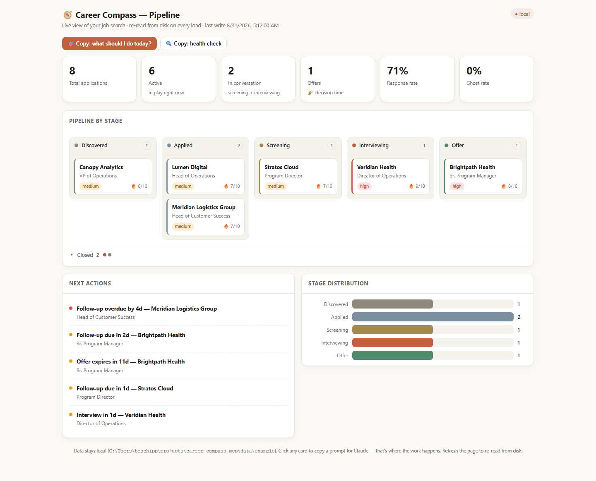

<h1>
  <picture>
    <source media="(prefers-color-scheme: dark)" srcset="https://raw.githubusercontent.com/benskamps/career-compass-mcp/main/docs/assets/brand/banner-dark.png">
    
  </picture>
</h1>

[](https://www.npmjs.com/package/career-compass-mcp)
[](https://www.npmjs.com/package/career-compass-mcp)
[](LICENSE)
[](https://nodejs.org)
[](https://modelcontextprotocol.io)

**Paste a job posting. Get an honest fit verdict.**

Paste a job posting and your resume, and ask "Do I fit this?" You get a straight verdict
(strong fit, stretch, or long shot), each of the posting's must-haves matched to evidence
from your own background, and the top two gaps with how to handle them. Then Claude can
tailor your résumé, write the cover letter and prep the interview without padding your
history. Free, MIT-licensed, and in Claude Code and Cowork your files stay on your own
computer.

## What a fit check looks like

<p align="center">
  
</p>

*A real run:* the `explore_opportunity` output on the bundled sample data,
and Claude's reply to it, trimmed for length (every cut is shown as "…"). Also as an
[MP4](docs/assets/demo/demo.mp4); how it was made is in
[docs/assets/demo/source](docs/assets/demo/source/README.md).

Another example in text, on the same fictional Alex Rivera who ships with the package and a
different made-up posting:

```
You:    [pastes a VP of Operations posting from a payments company]
        Do I fit this?

Claude: Stretch: strong on operations at scale, but no P&L or payments
        experience yet.

        Must-haves, with your evidence
        - 8+ years leading operations teams: Operations Manager at Apex
          Logistics, team of 42; Senior Program Manager at MedFlow, 6 PMs.
        - Scaling a process across sites: patient onboarding cut from 47 days
          to 11 across 3 acquired health systems.
        - Vendor and cost management: procurement cycle cut from 9 months to
          6 weeks; headcount costs down 18% while throughput rose 31%.

        Top two gaps
        1. P&L ownership. You ran $8M in program budgets, which isn't a P&L.
           Say what that budget covered, and ask in the screen whether the
           role owns a P&L from day one.
        2. Payments. Nothing in your history is payments or fintech. Lead
           with the healthcare compliance work as the closest thing, and
           don't claim more.

        Want me to tailor your résumé to this one, or track it?
```

The real reply goes on with talking points, red flags and questions to ask. A "day in the
life" of the role comes only when you ask for one.

## It won't pad your résumé

Every sentence it writes about you has to come from your history or from what you told it.
When a stronger draft needs a fact it doesn't have, the draft says so in place:

```
- Cut patient onboarding from 47 days to 11 after the acquisition of 3
  regional health systems, leading a team of [confirm: team size] and
  eliminating $2.1M in compliance penalties over 18 months.
```

The sample record says what changed, not how many people did it, so the bullet asks. You
fill in the bracket or cut it; nothing gets invented to sound stronger.

## Get it in the Claude directory

In the Claude app or on claude.ai, open **Customize → Plugins**, search for
**Career Compass**, and add it. That's the whole install.

| Where you use Claude | What you get |
|---|---|
| **claude.ai chat** (web, desktop, mobile) | The skills only. Paste a résumé and a posting and Claude does the fit check, tailoring, interview prep or offer review in the conversation. Nothing is saved between chats. |
| **Cowork** and **Claude Code** on your computer | The skills plus the local server: your career history and every application are kept as plain YAML on your computer, so later answers start from them. Needs **Node.js 22 or newer**. |

The commands below work in Claude Code and Cowork. In claude.ai chat, just ask in plain
words ("prep me for my interview on Friday").

| Command | What it does |
|---|---|
| `/career-compass:start` | Sets up your career history from a pasted résumé, or shows what to try first |
| `/career-compass:fit-check` | A fit verdict for a pasted posting |
| `/career-compass:interview-prep` | Likely questions, three to five STAR stories from your real work, and questions to ask |
| `/career-compass:today` | One "start here" move, then the rest of today's list |
| `/career-compass:debrief` | Right after an interview: what landed, what to sharpen, and a thank-you note per interviewer from your own notes |
| `/career-compass:week` | Your week: what moved, stalled or closed, your pace, and one focus for next week |
| `/career-compass:sweep` | Checks your inbox and calendar (through connectors you already use) for job-search mail and invites, then updates applications in one batch you approve. Never sends email |
| `/career-compass:answer` | Answer an application form's questions from your real history |

A few things it does once you've used it for a while: saves end with a receipt of what
changed, you can record an offer or how an interview round went, and `/career-compass:today`
leads with a debrief the day after an interview. When you accept an offer it switches to
closing out the search and then to your first weeks in the new job. If you want a nudge,
you can set up a [morning briefing](#a-morning-briefing-if-you-want-one) on your own
computer.

## Turn your git history into honest résumé evidence

If you write code, you have a record of what you did. Ask:

> **"Look at my project in ~/code/billing-service and tell me what I can honestly claim on my résumé."**

`harvest_evidence` reads that project's git history on your computer and reports counts,
each with the command that produced it. It writes nothing and sends nothing.

```
## What is measurably true
- Committed to billing-service across 14 distinct months, 2024-11 to 2025-12.
  - how: git log --no-merges --author=<you> --since=2024-10-07; counted distinct YYYY-MM values.
- 212 of 530 non-merge commits in this window are yours (40%).
  - how: git rev-list --count --no-merges, with and without --author. Share of commits,
    which is a measure of participation and NOT of contribution size.

## What this cannot tell you
- Did any of this ship to real users, and did anything measurable change when it did?
  That number is the résumé line; none of the above is.
```

*Example on made-up numbers.* Counts are not achievements, so Claude asks the questions the
log can't answer first. Say you built the invoicing service and it shipped, and the draft
keeps to that:

```
- Built the invoicing service in billing-service over 14 months (212 commits),
  which [confirm: what changed for users once it shipped, and by how much?].
```

## Tell me what it got wrong

There is no telemetry, so the only way I hear about a bad fit check is if you say so.
[Open a "What did your first fit check get wrong?" issue](https://github.com/benskamps/career-compass-mcp/issues/new?template=fit-check-wrong.yml)
(leave out anything personal), or say what you used it for in
[Discussions](https://github.com/benskamps/career-compass-mcp/discussions).

More: [How Career Compass works](https://benskamps.github.io/career-compass-mcp/how-it-works/),
with pages for [people who were laid off](https://benskamps.github.io/career-compass-mcp/for/laid-off/),
[career switchers](https://benskamps.github.io/career-compass-mcp/for/career-switchers/) and
[new grads](https://benskamps.github.io/career-compass-mcp/for/new-grads/).

---

## For other MCP clients

Everything below is for running the server yourself, outside the Claude directory: Claude
Desktop, Cursor, other MCP clients, or Claude Code without the plugin. If you installed the
plugin, skip it. Running the command below as well would register a second copy of every
tool, so `install` detects the plugin and leaves Claude Code alone.

The package has 19 tools, 4 prompts, 9 resources and a local dashboard. To see the
dashboard on the bundled sample first, with no install and no data of your own:

```bash
npx -y career-compass-mcp dashboard --sample
```

It opens in your browser, read-only, against the fictional Alex Rivera search. Nothing is
written and nothing leaves your machine.

### Everywhere else, in one command

One command wires every Claude client on your machine — Claude Desktop, Claude Code, and
Cursor — and tells you what to restart:

```bash
npx -y career-compass-mcp install
```

It backs up any config it touches, leaves your other servers alone, skips clients you don't
have, and does nothing twice. It pins the version it installs and downloads it once up front,
so no launch ever reinstalls; run it again to upgrade. `--dry-run` shows the plan first; `--data /path/to/career-data`
puts your files somewhere other than `~/.career-compass`. Then say to Claude: **"Run the
Career Compass setup check."**

Prefer to do it by hand, or use another client? Every route below runs the same server, and
none of them needs a clone or a build.

### Claude Code

One command:

```bash
claude mcp add career-compass -s user -- npx -y career-compass-mcp
```

`-s user` installs it for every project rather than just this one. Confirm it landed with
`claude mcp list`.

To keep your career files somewhere other than the default `~/.career-compass`:

```bash
claude mcp add career-compass -s user -e CAREER_DATA_PATH=/path/to/career-data -- npx -y career-compass-mcp
```

### Claude Desktop

**The extension bundle is the short way.** Download the `.mcpb` file from the
[Releases page](https://github.com/benskamps/career-compass-mcp/releases/latest), then in
Claude Desktop go to **Settings → Extensions** and install it. There is no JSON to edit and
nothing to install first. Set `CAREER_DATA_PATH` in the extension's own settings if you
want your files somewhere other than `~/.career-compass`.

The bundle does not self-update: to upgrade, download the newer `.mcpb`, remove the
installed extension, and install the new file. Note your data path before removing it —
settings are re-entered on install, and `check_setup` prints the path.

**Or point Claude Desktop at npx.** Open **Settings → Developer → Edit Config**, or edit
the file directly:

| OS | Config file |
|----|-------------|
| macOS | `~/Library/Application Support/Claude/claude_desktop_config.json` |
| Windows | `%APPDATA%\Claude\claude_desktop_config.json` |
| Linux | `~/.config/Claude/claude_desktop_config.json` |

Add the server:

```json
{
  "mcpServers": {
    "career-compass": {
      "command": "npx",
      "args": ["-y", "career-compass-mcp"]
    }
  }
}
```

Pin a version in `args` (`"career-compass-mcp@2.11.2"` rather than the bare name) if you can:
Desktop starts the server twice at once, and an unpinned name reinstalls on every release,
which can leave npx's cache half-written (see **On npx** below). `install` does this for you.

Restart Claude Desktop. To choose your own data directory, add an `env` block alongside
`args`:

```json
"env": { "CAREER_DATA_PATH": "/Users/you/career-data" }
```

### Any other MCP client

Cursor, Windsurf, Cline, Continue and friends all take the same shape — a stdio server
with `command: "npx"` and `args: ["-y", "career-compass-mcp"]`. Drop that into whatever the
client calls its MCP config.

**Zed** — add to your `settings.json`:

```json
{
  "context_servers": {
    "career-compass": {
      "command": {
        "path": "npx",
        "args": ["-y", "career-compass-mcp"]
      }
    }
  }
}
```

### Prefer a global install

```bash
npm install -g career-compass-mcp
```

Then use `"command": "career-compass-mcp"` with no `args`, or
`claude mcp add career-compass -s user -- career-compass-mcp`.

### Confirm it worked

Ask Claude:

> **"Run the Career Compass setup check."**

That calls `check_setup`, which reports your version against the current npm release, where
your data directory is, which Career KB sections are filled in, whether your pipeline
parses, and whether the dashboard is running — each finding with the one command that fixes
it. It is read-only, so it runs without a permission prompt.

---

## Your first conversation

Open Claude and say:

> **"Set up my Career KB. Here's my résumé:"** [paste your résumé]

Claude will extract your work history, achievements, and skills into structured YAML, ask
clarifying questions about gaps or vague metrics, and call `save_career_section` once per
section to write it to disk.

`save_career_section` is where your history actually lands. It saves one section at a time
(`profile`, `experience`, `skills`, `education`, `projects`, `testimonials`), validates
against the schema before touching the file, and keeps the previous version as a
timestamped `.bak`. It compares each save with what is stored: a save that would drop roles
or achievements is refused unless the call says to replace them, and every save ends with a
one-line receipt of what changed. Your client asks you to confirm each write; approving them
is what fills the KB.

That is the whole setup. From there every tool has full context on who you are, and the KB
compounds — each posting you explore, interview you debrief, and offer you weigh can add a
dated signal back to it.

**Already have material lying around?** Performance reviews, award emails, recommendations,
old project write-ups — paste any of them and ask Claude to pull the achievements out. That
is `ingest_document`. It reads and extracts but never writes; `save_career_section` is still
what puts the results on disk.

---

## Your data stays on your machine

Career Compass is local-first by design. Your real career data — résumé history, the
companies you are talking to, salary numbers, interview notes — lives in **plain YAML files
on your own disk**.

- **Where it lives:** `~/.career-compass/` by default, or wherever you point
  `CAREER_DATA_PATH`. The directory is created on first run, on *your* machine, and is not
  part of the npm package.
- **Who sees it:** only the MCP client you connect it to, and through that client your model
  provider, under *their* policy — and only for the requests you make. Career Compass sends
  it nowhere on its own.
- **The one request the server makes:** `check_setup` asks the public **npm registry**
  whether a newer version has been released. It is an unauthenticated GET for the package
  name, carrying nothing about you or your data, and it only happens when `check_setup` is
  called with `checkForUpdates: true`, which Claude does when you ask about updates. It is
  off by default. There is no analytics or phone-home path anywhere else in the package.
- **Requests you run yourself:** any `npx … career-compass-mcp` command, including the
  dashboard command `check_setup` prints, has npm download the package from the same
  registry. That is npm fetching code, and it carries none of your data.
- **The dashboard's `--ask-claude` option** runs Claude Code on your computer, which sends
  the Career KB content it reads to Anthropic under your own Claude account and billing.
  It is off unless you start the dashboard with it, and read-only unless you start it with
  `--ask-claude-writes`.
- **Schedules are yours:** Career Compass runs nothing on a timer. A
  [morning briefing](#a-morning-briefing-if-you-want-one) is a task you create in your own
  Claude app; it runs on your computer and only reads.
- **What ships in the package:** the server code and a small set of **fictional** example
  files (`data/example/` — the Alex Rivera persona). A publish-time leak guard enforces that
  no real career data can ride along.
- **The dashboard reads at request time, locally.** Your YAML is read when you open a page,
  by a server on your own `localhost`. It is never baked into a build, never prerendered,
  and never sent over the network.
- **What else is in that folder:** timestamped `.bak` copies of previous versions (only
  the newest 5 per data file are kept; older ones are deleted automatically on the next
  write, and backups you make by hand are never touched), plus — only while a write is actually happening — a
  `.write-claim` file that stops a second Career Compass process from writing at the same
  time.
- **Retention is yours:** files stay until you delete them. Remove the `CAREER_DATA_PATH`
  directory and everything is gone.

Treat `~/.career-compass/` like any private notebook — back it up, and do not commit it to a
public repo. (This repo's `.gitignore` already excludes `data/career/` and `data/pipeline/`.)

Full policy: **[PRIVACY.md](PRIVACY.md)** ·
published at <https://benskamps.github.io/career-compass-mcp/privacy> ·
questions or concerns: [open an issue](https://github.com/benskamps/career-compass-mcp/issues)

---

## A morning briefing, if you want one

Career Compass never runs on a timer. If you'd like your job-search list waiting each
morning, you can create a **local** scheduled task in the Claude Code desktop app (see
[desktop scheduled tasks](https://code.claude.com/docs/en/desktop-scheduled-tasks)). A local
task runs on your computer, so it reaches the server and your data folder. Give it this
prompt, as plain text:

> Call pipeline_view with action next_actions. Lead with the Start here item in eight lines or fewer, and change nothing. If it's after 2pm, say it's a catch-up run.

Use the plain prompt rather than `/career-compass:today`: scheduled runs don't start
commands that only run when you type them. `pipeline_view` only reads, so the briefing
changes nothing. Cowork's scheduled tasks may run remotely, where your local data folder
isn't available, so try one by hand before relying on it. Cloud routines and `/loop` don't
fit this: cloud runs can't see your files, and `/loop` ends with the session.

---

## Tools

Eighteen tools, grouped by where they land in a search. **Read** tools take no permission
prompt in most clients; **Write** tools ask before touching your files.

### Find and assess a role

| Tool | Access | What it does |
|------|--------|-------------|
| `explore_opportunity` | Read | Judges a posting against your KB **and your stated preferences** — salary band, remote, relocation, notice period. Opens with a verdict (Strong fit, Stretch, or Long shot) and the biggest reason, then an explicit comp and location check, evidence per requirement, honest gaps, talking points and red flags. A "day in the life" only when you ask. Pass `sourceFitLabel` ("LinkedIn: strong match") and it will agree or disagree with the job board, in both directions |
| `research_company` | Read | Builds an intelligence brief: product, culture, funding, interview process, strategic fit |

### Apply

| Tool | Access | What it does |
|------|--------|-------------|
| `tailor_resume` | Read | Writes a résumé tailored to one posting from your KB — standard, federal, academic, or functional — using the posting's words only where your history says the same thing |
| `generate_cover_letter` | Read | Writes a cover letter with your actual achievements woven in, in a tone you pick — professional, conversational, enthusiastic, or concise |
| `format_for_ats` | Read | Reformats résumé text you already have into plain sections an applicant tracking system can parse, ready to paste field by field (Workday, Greenhouse, Lever, LinkedIn, iCIMS, Taleo, SmartRecruiters, or generic). Reformats only; it never rewrites what you did |
| `answer_application` | Read | Answers an application form's questions from your KB, each within its limit. Work authorization, salary and start date come only from what you saved or said, and a "years with X" your history can't support is flagged, never inflated |

### Track the pipeline

| Tool | Access | What it does |
|------|--------|-------------|
| `pipeline_view` | Read | Lists applications, funnel stats, what needs attention, or one application by id |
| `pipeline_add` | Write | Adds one application, dated the day you applied (`dateApplied`, defaults to today). Optional starting `status` (defaults to `applied`); unknown statuses are rejected with a did-you-mean suggestion |
| `pipeline_update` | Write | Updates one application — status, notes, follow-up date, a contact, an interview round and how it went, or an offer's terms and answer deadline |
| `classify_email` | Read | Classifies a job-search email and extracts contacts, dates, and suggested pipeline updates |

### Interview and decide

| Tool | Access | What it does |
|------|--------|-------------|
| `prepare_interview` | Read | Full prep: opening pitch, STAR stories, likely questions, company alignment, questions to ask |
| `interview_arc` | Read | Mid-process projection. Reconstructs the arc so far from your recorded rounds and journal signals, then projects what the **next** round will probe — ground already covered, threads the last interview left open, gaps nobody has tested yet, ranked likely questions |
| `evaluate_offer` | Read | Breaks down total comp, compares to market, builds negotiation strategy, drafts counter scripts |
| `generate_rejection_response` | Write | Drafts a graceful keep-the-door-open reply. Pass `applicationId` and it also marks that application rejected |

### Feed the knowledge base

| Tool | Access | What it does |
|------|--------|-------------|
| `save_career_section` | Write | Writes one section of your Career KB as plain YAML — this is how the KB gets populated. Replaces the whole section; the previous version is kept as a `.bak` |
| `ingest_document` | Read | Extracts achievements from any document: performance review, award email, recommendation, project summary |
| `capture_insight` | Write | Appends a dated signal to your career journal — fit signals, interview insights, offer reflections, rejection patterns, skill evidence, wins — which later résumé, interview, and fit prompts read back |
| `harvest_evidence` | Read | Reads a local project's git history and reports what you measurably did there — months active, files and file types touched, your share of commits, test ratio — each with the exact command that produced it. Only your own commits count, and it names the identity it used. It writes nothing, anywhere |

### Keep the install healthy

| Tool | Access | What it does |
|------|--------|-------------|
| `check_setup` | Read | Health-checks the install in one pass — version vs. the current npm release, data directory, filled KB sections, pipeline parse, leftover temp files, dashboard status — each with the one command that fixes it. Run it first when anything seems off |

---

## Resources

Claude can read these directly ("read my career profile"):

| Resource | URI | Contents |
|----------|-----|----------|
| Career Profile | `career://profile` | Name, contact, summary, targets, preferences |
| Work Experience | `career://experience` | Full history with achievements |
| Skills Inventory | `career://skills` | Skills with proficiency and recency |
| Projects | `career://projects` | Portfolio with outcomes |
| Education | `career://education` | Degrees, certifications, coursework |
| Testimonials | `career://testimonials` | Quotes, recommendations |
| Career Journal | `career://journal` | Dated signals captured over time |
| Full KB | `career://full` | Everything above in one read |
| Pipeline | `career://pipeline` | All applications with status |

**They are live.** Career Compass implements MCP resource subscriptions: subscribe to a
resource and the server tells you when the file behind it changes on disk — whoever changed
it, whether that was a tool call, the dashboard, or you in an editor. Three peers share one
directory of plain files and none of them owns it. Nothing is watched until a client
subscribes, so a client that never does pays nothing for the feature.

---

## Prompts

Power-user shortcuts for MCP clients that show prompts, usually as slash commands. Plugin
users get the `/career-compass:…` commands above instead.

| Prompt | What it does |
|--------|-------------|
| `resume-tailor` | Drop in a posting → get a tailored résumé |
| `negotiation-coach` | Paste an offer → analysis, strategy, and counter scripts |
| `post-interview-debrief` | Capture what an interview surfaced → record the durable signal, set up the next step |
| `weekly-retro` | Review the week's movement and journal signals → one takeaway that compounds |

Retired: `daily-review`, `interview-coach` and `setup-career-kb` duplicated the plugin's
`/career-compass:today`, `/career-compass:interview-prep` and `/career-compass:start`. Ask
for the same thing in plain words and the tools do it.

---

## The dashboard

A local web view of the same YAML the tools read. It ships inside the npm package as a
single self-contained HTML page with no build step, no dependencies, and no external
assets — pipeline KPIs, a kanban board by stage, a next-actions panel (overdue follow-ups,
upcoming interviews, expiring offers), and a stage-distribution chart.

```bash
# The bundled demo — no clone, no build, no data of your own:
npx -y career-compass-mcp dashboard --sample

# Your own data (CAREER_DATA_PATH, or ~/.career-compass if unset):
npx -y career-compass-mcp dashboard
```

It re-reads your YAML on **every request**, so a browser refresh always shows the current
state of your files. Stages change through Claude — ask it to move an application and it
calls `pipeline_update`; the board reflects that on the next load. Click a card to open its
detail drawer (days in stage, follow-up, posting link, contacts, interview rounds, latest
note); the drawer's button and every next-action row copy a ready-to-paste prompt for
Claude, which is where the work actually happens. Type in the filter box (or press `/`) to
narrow the board by company or role; the column counts follow.



`--sample` (alias `--demo`) resolves the demo *inside the installed package*, wherever npx
put it, so it works from any directory and any shell. The sample's dates are shifted to sit
around today each time it is read — so the pipeline always looks like a live search — and
Career Compass refuses to write into it.

**Make the buttons ask Claude for you.** If you have [Claude Code](https://docs.anthropic.com/en/docs/claude-code)
installed, start the dashboard with `--ask-claude`:

```bash
npx -y career-compass-mcp dashboard --ask-claude
```

Every card, next-action row, and toolbar button then asks Claude directly instead of copying a
prompt — the server runs `claude` headless with Career Compass as its only tool set, and the
answer streams into a panel on the page, with a *Reload the board* button when Claude may have
changed your files. It is opt-in, loopback-only, one question at a time, and Claude Code runs
without your user hooks, without other MCP servers, and without shell or file-editing tools.
It is read-only unless you start it with `--ask-claude-writes`. Prompts that need you to
paste a posting still copy. Without the flag (or without Claude Code) the buttons copy,
exactly as before.

Each question runs under your own Claude account: Claude Code sends the Career KB content it
reads to Anthropic, and the usage is billed to you like any other Claude Code session.

Other flags: `--port <n>` (default 3141, falling back to the next free port), `--no-open` to
skip launching a browser, `--lite` to force this dashboard explicitly. Full list:
`career-compass-mcp --help`.

> **A second, frozen dashboard exists.** The repo also contains a full Next.js app — kanban
> with a detail view, an onboarding wizard, analytics. It is **not** in the npm package and
> is frozen as a design reference rather than a product; GUI investment goes to the
> dashboard above. See [`dashboard/FROZEN.md`](dashboard/FROZEN.md) for the reasoning. An
> in-Claude MCP App board is deferred too: Claude renders MCP Apps only for remote HTTP
> connectors, not the local stdio transport this ships as.

---

## The files on disk

```
~/.career-compass/          # or wherever CAREER_DATA_PATH points
├── career/
│   ├── profile.yaml        # who you are, what you're targeting
│   ├── experience.yaml     # roles, achievements (metrics + context + impact)
│   ├── skills.yaml         # skills with proficiency and recency
│   ├── education.yaml      # degrees, certifications, coursework
│   ├── projects.yaml       # portfolio projects
│   ├── testimonials.yaml   # quotes and recommendations
│   └── journal.yaml        # dated signals, appended over time
└── pipeline/
    └── applications.yaml   # all job applications
```

Optional sections (`narrative.yaml`, `stories.yaml`, `people.yaml`) appear in `career/`
the first time you save one.

This is your single source of truth — built once, enriched over time, read by every tool.
You never need to edit these files by hand: paste a document and ask Claude to save it. But
they are plain YAML, so you can.

[`data/example/`](data/example/) in this repo is a fully populated sample (the fictional
Alex Rivera) if you want to see the shape before writing your own.

---

## Configuration

| Env var | Default | Description |
|---------|---------|-------------|
| `CAREER_DATA_PATH` | `~/.career-compass` | Directory holding your career and pipeline YAML |

Plugin users set the same thing in the plugin's settings as **Career data folder**
(`data_path`, default `~/.career-compass`). The plugin passes it to the server as
`CAREER_DATA_PATH`.

---

## Troubleshooting and upgrading

**If anything seems off, start here:**

> **"Run the Career Compass setup check."**

`check_setup` is read-only and usually answers the question before you have to debug
anything. It is also the fastest way to find out you are simply on an old version, which is
the most common cause of "this feels rough around the edges."

Your career data is never touched by an upgrade. It lives in `CAREER_DATA_PATH`, not in the
package, and older data directories keep working — sections added by later releases are
created when you first write them.

**On npx.** `install` pins the version it writes (`career-compass-mcp@<version>`), so
upgrading is running it again, then restarting your client:

```bash
npx -y career-compass-mcp@latest install
```

A hand-written entry with the bare name (`npx -y career-compass-mcp`) asks npm for the latest
version on every launch and reinstalls into one shared cache folder after each release. Claude
Desktop starts the server twice at once, and the two reinstalls can collide and leave that
folder half-written. If the server log shows `Cannot find module` or `ENOTEMPTY` under
`npm-cache\_npx`, delete the `_npx` folder inside your npm cache (`npm config get cache` prints
where it is; `npm cache clean --force` does not touch it), then run the `install` command above.

**On a global install.** `npm install -g career-compass-mcp@latest`, then
`career-compass-mcp --version`. Restart your client afterward — it keeps the old server
process alive until it does.

**From source.** `git pull && npm install && npm run build:mcp`, then restart your client. A
source checkout normally reports itself as *ahead* of npm in `check_setup`; that is
expected, not drift.

---

## How it works

```
┌─────────────┐          ┌────────────────────────────────────────┐
│             │   MCP    │           MCP server (Node.js)         │
│   Claude    │◄────────►│                                        │
│             │  stdio   │  Tools ······ résumé, pipeline, prep   │
└─────────────┘          │  Resources ·· Career KB, pipeline      │
                         │  Prompts ···· slash-command shortcuts  │
                         └───────────────────┬────────────────────┘
                                             │ reads + writes
                              ┌──────────────▼───────────────┐
                              │   Plain YAML on your disk    │
                              │       CAREER_DATA_PATH       │
                              └──────────────▲───────────────┘
                                             │ re-reads per request
                              ┌──────────────┴───────────────┐
                              │ Local dashboard (localhost)  │
                              └──────────────────────────────┘
```

No database, no server to host, no state the model has to carry between sessions. The files
are the interface.

**Diagrams:** [`docs/architecture.md`](docs/architecture.md) has the detailed version —
the path a posting takes from paste to offer, the application state machine, what happens
during your first conversation, how three peers share one directory without stepping on
each other, and why a write cannot be left half-done.

---

## Building from source

```bash
git clone https://github.com/benskamps/career-compass-mcp.git
cd career-compass-mcp
npm install                            # MCP server deps
cd dashboard && npm install && cd ..   # only if you want the frozen Next.js app
npm run build:mcp                      # or `npm run build` to include that app
```

Point your MCP config at `node /path/to/career-compass-mcp/build/src/index.js`.

The Next.js dashboard is a separate package with its own `package.json` and lockfile, so it
needs its own `npm install` — the root install deliberately carries neither Next.js nor
React, which keeps 166 MB out of every `npm i career-compass-mcp`.

Common tasks:

```bash
npm run dev            # TypeScript watch mode
npm run inspect        # MCP Inspector — exercise tools interactively
npm run test:mcp       # MCP server test suite
npm test               # server + dashboard suites
npm run visuals        # regenerate the screenshots in this README
npm run pack:mcpb      # build the Claude Desktop .mcpb extension bundle
npm run dev:dashboard  # frozen Next.js app, hot reload

# Develop against the fictional sample rather than your real data
CAREER_DATA_PATH=data/example npm run dev:dashboard
```

---

## Why Career Compass

Job searching is one of the highest-stakes, most document-intensive things most people ever
do — and most tools treat it as a data-entry problem. Spreadsheets for tracking. Templates
for résumés. Generic advice for interviews.

Career Compass treats it as a knowledge problem. Your career history is a corpus. Every
application is a retrieval and synthesis task. Every interview is a pattern-match against a
known dataset (the posting) and a known corpus (you).

The Career KB is the single source of truth — built once, enriched over time, read by every
tool. A tailored résumé draws from it. Interview prep draws from it. Cover letters draw from
it. The pipeline tracks against it. Nothing gets lost, because nothing lives in a tab you
will close.

---

## Did this help?

There is no telemetry in this package, so I have genuinely no idea whether it is working for
anyone. Download counts are mostly registry mirrors rather than people. That is the trade: the
privacy is real, and the consequence is silence.

So if Career Compass got you through a week of applications:

- **[Star the repo](https://github.com/benskamps/career-compass-mcp)** — the only signal that
  survives having no analytics.
- **[Say so in Discussions](https://github.com/benskamps/career-compass-mcp/discussions)** —
  what you used it for, what was missing, what you wish it did instead. Job searches differ
  enough that I would rather hear about yours than guess at it.
- **[Tell me what a fit check got wrong](https://github.com/benskamps/career-compass-mcp/issues/new?template=fit-check-wrong.yml)**
  — a short form; leave out anything personal.

None of these sends me anything you have not chosen to type.

## Contributing

[Issues](https://github.com/benskamps/career-compass-mcp/issues) and PRs welcome — bug
reports with a reproduction are especially useful, and they do get fixed.
[Discussions](https://github.com/benskamps/career-compass-mcp/discussions) is the place for
anything that is not a defect: questions, workflows, or a tool you wish existed. If you add a tool,
register it in `src/server.ts` and follow the
pattern in any existing tool file — each tool returns a structured prompt that Claude acts
on with the full KB in context. The test suite includes docs-truth guards, so a new tool or
prompt that is not documented here fails CI rather than surprising a stranger.

## License

MIT

---

*Part of the [Brokenbranch Lab](https://www.brokenbranch.dev/lab/) — Ben Schippers' workshop of AI-native tools and research.*
