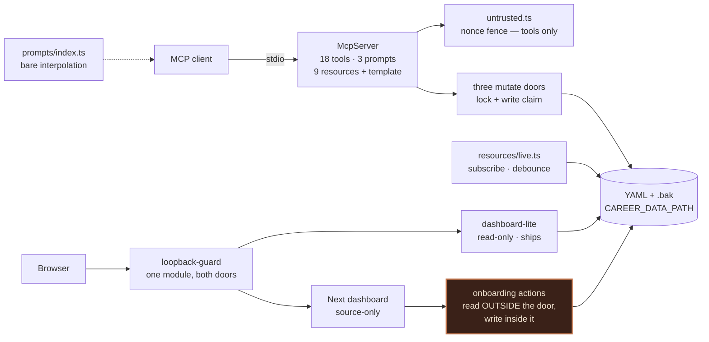
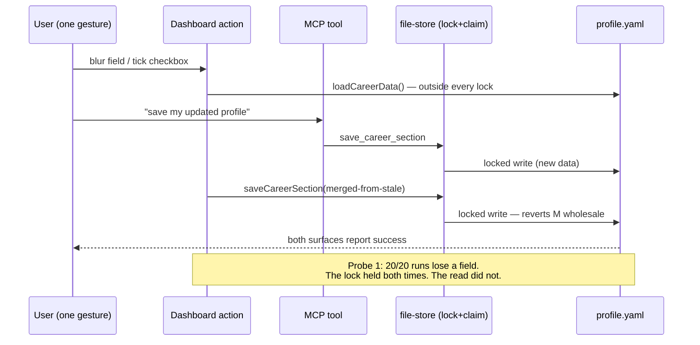
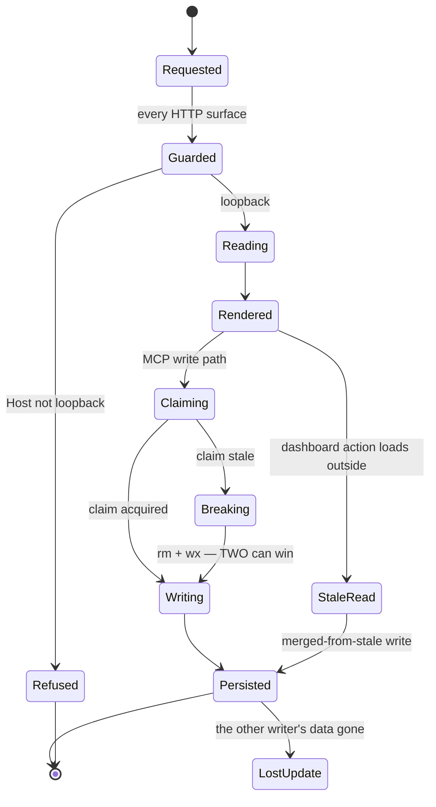
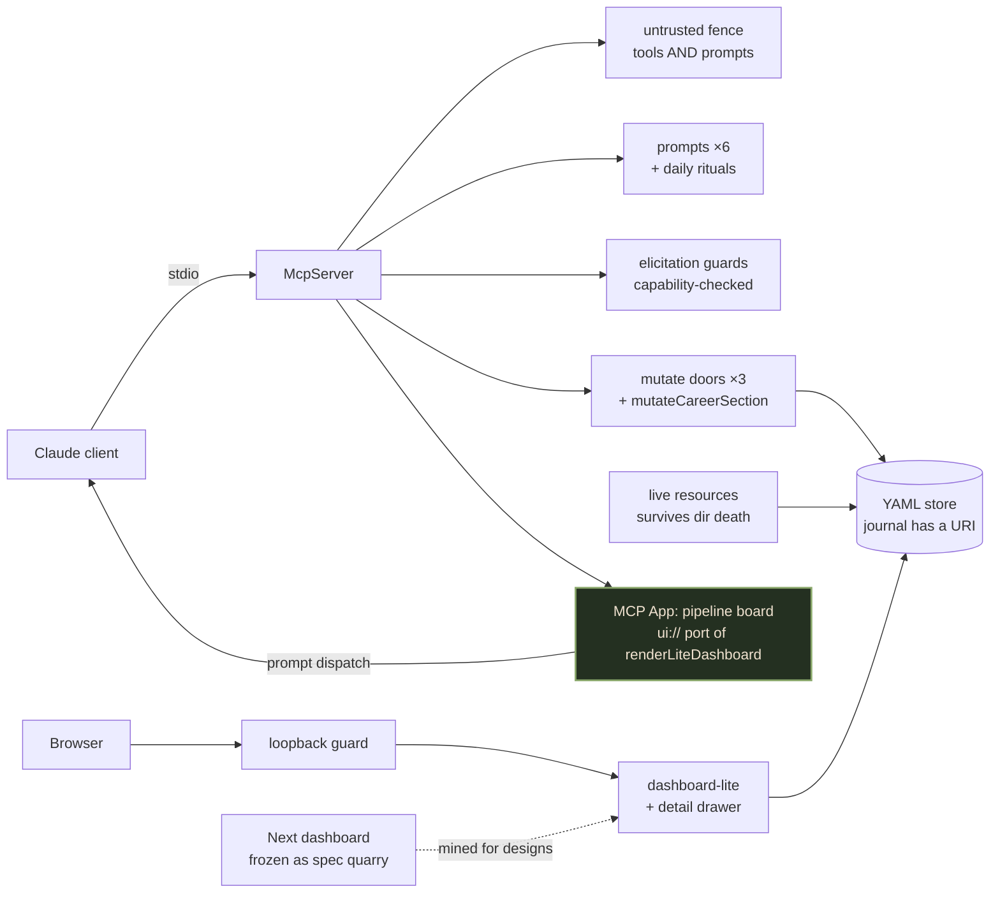
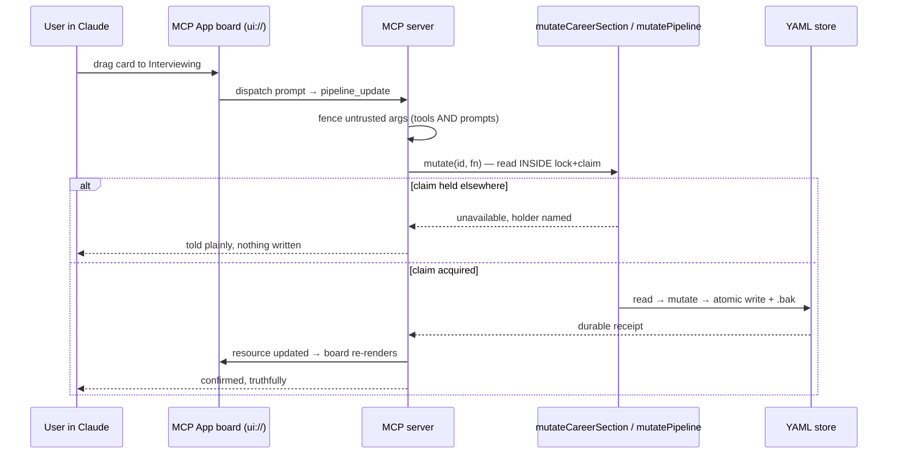
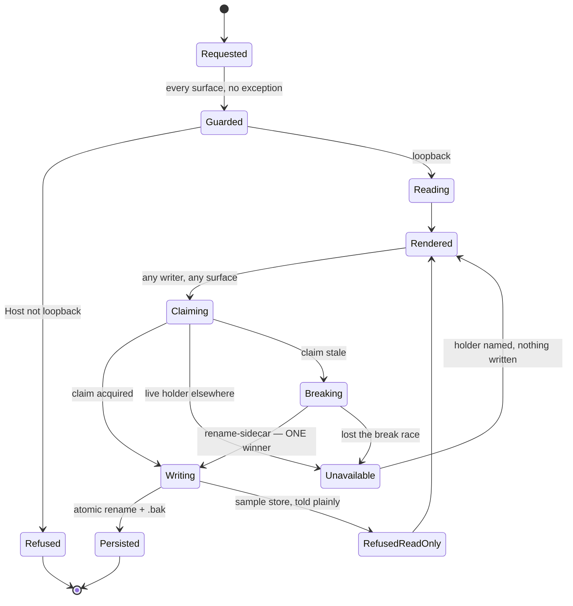

# Career Compass MCP — Architecture Audit (Gauntlet v2)

> **Consumer:** Ben Schippers, and the next engineer who touches a writer, a prompt, or the resource layer.
>
> **Status:** CANONICAL technical-architecture decision surface at `c23793b` (`main`, 2026-08-29, v2.5.1). This document supersedes and re-baselines the 2026-08-22 audit at `dc823a4`, whose nine findings were all remediated (PRs #37/#38 — see §18). It does not supersede the product/readiness question — that belongs to a `stranger-pass`.
>
> **This pass ran as a team:** a source-inventory lane, a state/concurrency lane with executed probes, a platform/runtime lane with wire-level probes, a product lane and a frontier-research lane, reconciled adversarially in §12.

## Limits of this pass

- **Inspected:** git baseline and the 11 commits since `dc823a4`; every non-test file under `src/`, `bin/`, `scripts/`; the dashboard app, components, actions, proxy, and configs; both test suites (run, not read); CI; `package.json`, `manifest.json`, `README.md`, `PRIVACY.md`; 24 fresh screenshots of every user-facing surface (both dashboards, desktop + mobile, light + dark, empty + demo + aged stores), each looked at by a person-shaped reader, not just captured.
- **Executed (not merely read):** the full test suite (414+1 MCP, 37 dashboard); `pack:guard`; `npm pack --dry-run` allowlist verification; the visual harness; five rerunnable concurrency probes (scratchpad, `npx tsx`, no repo files touched); raw-socket Host-header probes against a live server; a boot of the standalone Next build under an attacker `Host`; an `initialize` handshake against the built server over stdio.
- **Not inspected:** npm registry telemetry; any real user's `~/.career-compass`; the published `.mcpb` as Claude Desktop mounts it; Next's production error-masking behavior (one §12 residual); a data dir on an actual OneDrive-synced path.
- **Not attempted:** no exploit against any real store or live user process. The concurrency probes ran against scratch directories with the repo's own modules — they are tests, and they are rerunnable. Security findings remain code-reading plus absence-proven-by-search; where exploitability was not attempted it is labelled `UNKNOWN`.
- **Evidence labels:** `PROVEN — repository` · `PROVEN — platform` · `EMPIRICAL` · `ESTIMATED` · `PRODUCT DECISION` · `UNKNOWN`.
- **External-seat honesty (Gate D routing):** the den's gemmi seat delivered the product lane but argued from the brief without reading source — its claims were adjudicated against the repo in §12. The codex seat was sandbox-blocked (`helper_unknown_error: apply deny-read ACLs`, surviving a fresh session and a forced canary), so the platform lane ran as a Claude pass. Nothing below silently downgrades an external review to a self-review; this line is the disclosure.

## Executive verdict

The 2026-08-22 gauntlet ended: *"the defect is not in what was built, it is in where the care stopped."* The remediation moved the wall — and the wall held: the loopback guard fail-closes on all nineteen adversarial Host shapes probed on a live socket, the write claim's crash-recovery is immediate, the packaging allowlist blocked one hundred percent of 188 compiled test artifacts, and PRIVACY.md survives a line-by-line check against the code. The storage layer remains the best-argued code in this estate.

**The v2 defect is one sentence: every discipline in this repository is real where it was born and absent where it moved.** The three P1s all have that shape. The read-modify-write discipline lives in `mutatePipeline` — and the dashboard's onboarding actions do their read outside it, so a lost update the lifecycle spec declares unreachable was reproduced in twenty out of twenty runs. The injection fence lives in `untrusted.ts` — and the prompts surface interpolates the same untrusted arguments bare, unscanned by the structural test that guards the tools. The claim's single-winner argument lives in a comment on the `wx` create — and the stale-claim break path above it lets two breakers both win, proven by syscall replication.

**Gate 0 is the release blocker for any enrichment work:** the fence and the mutate door must move to every surface that has the data, *before* new prompts, new tools, or an MCP App multiply those surfaces. The enrichment agenda this pass was asked to serve is real and well-supported (§9) — and its first item lands directly on the unfenced prompt surface.

## 1. Purpose

Give a job-seeker an AI-native career co-pilot that keeps every piece of leverage — history, pipeline, salary floor, interview notes, a journal that compounds — as plain files on their own disk, so the tool can be inspected, edited by hand, and deleted, rather than trusted.

## 2. What is actually built

An MCP server over stdio (`src/index.ts`) exposing **18 tools** across six domains, **3 prompts**, **9 resources plus one completable resource template** (`career://pipeline/{id}`, with a `list` callback that makes applications browsable), and **live resources** (`resources.subscribe`, fs.watch-backed, 250 ms debounce, blind to `.bak`/`.tmp`/`.write-claim`). State is YAML under `CAREER_DATA_PATH` (default `~/.career-compass`): six Career KB sections, an append-only journal, and `pipeline/applications.yaml`.

Every production mutation goes through exactly three doors, all lock-and-claim protected — `saveCareerSection`, `appendJournalEntry`, `mutatePipeline` (`file-store.ts:298,334,415`) — verified by call-graph in this pass; `savePipelineUnlocked` is fenced by a truth test. A cross-process **write claim** (`.write-claim`, `wx`-create, 30 s TTL, pid-liveness break, nonce-guarded release) arbitrates the MCP server against the dashboard.

Two viewers: `src/dashboard-lite/` (zero-dep, read-only, ships to npm, Host-guarded before path parse) and `dashboard/` (Next.js 16, source-build only, guarded by `proxy.ts` with no matcher carve-outs, writing through four Server Actions). `bin/cli.ts` prefers the Next build only when it is both built **and staged** (`.next/static` copied by `scripts/stage-standalone.mjs`) — an unstaged build is deliberately treated as no build, because *plain beats broken*.

Since `dc823a4`, the repo also gained `harvest_evidence` (git-measurement tool that spawns argv-only, distinguishes missing-git from missing-repo, and refuses on principle to write its findings anywhere), argument completions ranked on company/role, and the visual harness (`npm run visuals`, 24 shots including empty and aged stores).

## 3. Current architecture

The guard is now genuinely shared — one module, four use sites, applied before routing on both surfaces. The clay node is the v2 story: the Server Actions call `loadCareerData()` before entering the locked door, so the lock protects the write and not the read-modify-write. The prompts surface (dashed) reaches the model without passing the fence the tools pass.

## 4. Reality versus constraints

| Constraint | Current approach | Verdict | Evidence class |
| --- | --- | --- | --- |
| Data never leaves the machine | One disclosed, skippable registry GET; `privacy-claims.test.ts` enforces the wording across four surfaces with four negative controls. PRIVACY.md verified claim-by-claim against code this pass. | Match. | `PROVEN — repository` |
| Loopback-only dashboards | Shared guard, both surfaces, before routing; fail-closed on all 19 adversarial Host shapes probed, including HTTP/1.0-no-Host, absolute-form targets, duplicate Host, zone-ids, userinfo, decimal-IP. Standalone build booted and probed: the proxy **runs** (`Host: evil.com` → 403 incl. `/_next/static/*`). | Match — and now `EMPIRICAL`, not just read. | `EMPIRICAL` (raw-socket probes) |
| One writer at a time per data dir | Write claim: `wx` create, TTL, immediate dead-pid break, nonce-guarded release. | **Mismatch at the margins.** The stale-claim *break* path admits two winners (§5 P1-2); TTL-before-liveness can break a live-but-stalled writer (§5 P2-2). The happy path holds. | `EMPIRICAL` (probes 2, 3) |
| Every read-modify-write happens inside the lock | True for all of `src/` — three doors, no bypass found by call-graph. | **Mismatch.** `dashboard/app/onboarding/actions.ts` loads outside, saves inside: lost update reproduced 20/20. | `EMPIRICAL` (probe 1) |
| Untrusted third-party text cannot impersonate instructions | `embedUntrusted` nonce fence at all tool interpolation sites, structurally tested. | **Mismatch.** `src/prompts/index.ts` interpolates `posting`, `notes`, `offerDetails`, `marketData` bare; the structural test scans `src/tools/*.ts` only. | `PROVEN — repository` |
| The lifecycle diagram cannot drift from the code | `lifecycle-spec.test.ts`: four behavioural tests, real and good. | **Partial.** The two grep-shaped tests are exactly where drift happened (§5 P2-4, P2-5); the machine also lacks states the code has (read-only-store refusal, the break path). | `PROVEN — repository` |
| The shipped artifact contains no personal data and no test code | `files` allowlist + negations verified by executed `npm pack --dry-run`: 0 of 188 compiled test artifacts leak; MCPB double-guard closes the 2.2.0 incident class at pack time. | Match. | `EMPIRICAL` |
| What the copy promises, the code does | `docs-truth` covers README↔tools. | **Mismatch on the dashboard.** README promises kanban drag that does not exist anywhere; the kanban empty state instructs a tool (`manage_pipeline`) the server would reject. | `PROVEN — repository` |

## 5. Health and tech debt

| Severity | Finding | Exact evidence | Consequence | Owner |
| --- | --- | --- | --- | --- |
| **P1-1** | Dashboard onboarding actions do read-modify-write outside the lock; `LostUpdate` — spec-declared unreachable — is reachable and reproduced **20/20**. | `dashboard/app/onboarding/actions.ts:21-26,32-34,41-43` load → merge → `saveCareerSection` (which locks only the write, `file-store.ts:298-300`). `step-salary.tsx:34-39` fires concurrent saves from one human gesture (blur + checkbox). Probe 1, rerunnable. | Two overlapping saves, or one racing an MCP `save_career_section`: the later write wins whole, both report success. Exactly the class `appendJournalEntry`'s own comment warns about (`file-store.ts:336-338`). | Gate 0 |
| **P1-2** | The stale-claim break admits two winners: the unconditional `rm` deletes the *other* breaker's freshly-won claim. | `write-claim.ts:230-235`. Syscall-replication probe 2: `{aWon: true, bWon: true}`, both enter the critical section. In-process tests cannot reach this interleaving (`serializeOn` queues same-process callers). | Post-crash stale claim + two processes walking into the break together (one user gesture can do it) → concurrent writers, the exact class the module exists to prevent. Fix shape: break by **renaming** the stale claim to a unique sidecar — rename picks exactly one breaker; `wx` then arbitrates. | Gate 1 |
| **P1-3** | The injection fence does not cover prompts. | `src/prompts/index.ts:26,30,74,118,120` interpolate bare the same argument names in `untrusted-boundary.test.ts`'s own `UNTRUSTED_ARGS` list (`:146-155`); the scan covers `src/tools/*.ts` only (`:145`). A forged `**Instructions for Claude:**` in a posting sits at the same heading depth as `resume-tailor`'s own `**Requirements:**`. | The exact exposure `untrusted.ts:10-24` was written to eliminate, on the surface the enrichment agenda wants to grow first. Exploitability `UNKNOWN` — not attempted. | Gate 2 |
| **P2-1** | Deleting a watched data subdir puts the server into a permanent ~157k events/sec busy loop, and live resources stay silently dead after the dir is recreated. | `live.ts:151-158`; probe 4b: ~78,500 events per 500 ms sustained, including post-recreate; a real write after recreation produced 0 events; fresh subscribes do not re-arm (`:143-163`). | Product copy invites exactly this ("open it, edit it, or delete it any time", `career-kb.ts:528`). Gated on an active subscription — which no Claude client holds today (§9) — hence P2. | Gate 6 |
| **P2-2** | TTL is checked before pid-liveness, so a live writer stalled >30 s is broken mid-write. | `write-claim.ts:109-114`; the claim brackets the whole `fn()` incl. backup pruning and rename retries (~465 ms of sleeps worst case before any AV/sync stall). Release path verified correct under theft (probe 3 — the only execution that branch has ever had). | An AV scan or OneDrive hydration pause turns one writer into two. Consequence understated by the module's single-digit-ms argument. | Gate 1 |
| **P2-3** | The journal is invisible: not in `FILE_TO_URI`, so `capture_insight` never dirties `career://full`; and no `career://journal` resource exists at all. | `live.ts:39-47` vs `file-store.ts:236`, `resources/career-kb.ts:139-147` (journal is part of `career://full`'s document). | The one KB section the product thesis says compounds over years is the one section with no URI and no notification — on the aggregate resource whose stated purpose is "any section changed." | Gate 3 |
| **P2-4** | `Unavailable → Rendered: told plainly` is enforced by substring grep and drifted on two surfaces. | `lifecycle-spec.test.ts:126-133` satisfied by an unrelated import; `generate_rejection_response` calls `mutatePipeline` at `career-kb.ts:256` with no handler. The dashboard flattens every failure — including the claim's who-holds-it message — to "Failed to save. Please try again." (`step-salary.tsx:24-26` and siblings). | A refused write surfaces as a raw transport error (third occurrence of the class the executable spec was built to catch) or an anonymous apology. Next prod error-masking `UNKNOWN` — not executed. | Gate 5 |
| **P2-5** | Read-path error handling is asymmetric across tools. | Bare `loadPipeline()` at `interview.ts:38,159,296`; every resource handler (`resources/career-kb.ts:19-227`); `dashboard/app/layout.tsx:27` — none carry the `isCorruptDataError`/`isWriteClaimUnavailable` handling all `pipeline.ts` sites have. | One corrupt `profile.yaml`: a clean repair message from `pipeline_view`, a raw transport error from `prepare_interview`. Same fault, two experiences. | Gate 5 |
| **P2-6** | The writers-declare-themselves negative control is blind to the biggest writer. | `tool-annotations.test.ts:83` `KNOWN_WRITERS` omits `save_career_section`; no `ARGS` entry either (`:52-81`) — that suite never invokes it. | The tool that replaces whole KB sections is outside the annotation truth-net. | Gate 5 |
| **P2-7** | User-facing copy promises what does not exist. | `README.md:194,206` "Drag to advance stages" — no drag code anywhere in `dashboard/` (proven by search); repeated by `bin/cli.ts:115` on every lite fallback. `kanban-board.tsx:65` empty state instructs `manage_pipeline` — a tool that does not exist. `docs-truth.test.ts` never scans dashboard copy. | The first screen a new Next user meets names a tool the server rejects; the README sells a gesture nobody implemented. | Gate 4 |
| **P2-8** | CI builds the dashboard but not the staging the CLI depends on. | `ci.yml:74` runs bare `npx next build`, not `npm run build:dashboard` (which chains `stage-standalone.mjs`). `cli.ts:103-104` requires staging to select Next at all. | The `f86a346` class (every route 200, zero CSS) is free to regress with CI green — the exact defect the visual pass caught is unguarded. | Gate 4 |
| **P2-9** | The analytics scatter chart is unreadable as shipped. | `excitement-vs-outcome.tsx:17` — Recharts `XAxis` without `type="number"` renders a *category* axis: `domain={[0,10]}` silently ignored, ticks are raw insertion-order values. Confirmed by screenshot. Y axis is raw `stageIndex` with no stage names; `data.length < 2` silently vanishes the chart. | The chart that promises the product's one novel correlation (excitement vs outcome) conveys nothing. | Gate 7 |
| **P2-10** | The aged store lies about liveness. | Screenshot of a 74-day-stale store: "6 Active — in play right now", KPI tiles identical to a fresh demo; only the header timestamp differs while five "overdue by 70-78d" rows glow below. Copy in `dashboard-lite/render.ts`. | Violates the same no-false-implication rule that produced `kpi()`'s null-over-zero discipline. | Gate 7 |
| P3 | Sixteen named papercuts. | (a) trailing-dot `localhost.` false-403 (`loopback-guard.ts:87-88` — fail-closed, availability only); (b) no staging freshness check — an interrupted `cpSync` leaves present-but-incomplete static served as staged (`stage-standalone.mjs:49-50`, `cli.ts:103-104`); (c) four comments name `career://application/{id}`, a URI space that does not exist (registered: `career://pipeline/{id}`); (d) `completions.ts:1-2` dead imports; (e) `completions.ts:38-42` false id-shape premise (real ids are 8-hex, `pipeline.ts:92`); (f) `render.ts:15-17` describes a Cowork/`sendPrompt` variant that does not exist in the repo; (g) `serialize.ts:24` chains map never pruned; (h) `pipeline.ts:150` stamps `dateUpdated` unconditionally, defeating the no-op skip; (i) sample-store refusal throws a plain `Error` and §11 has no state for it (`atomicWriteYaml:179-184`, `pipeline.ts:378`); (j) `untrusted.ts:66-70` claims the clamp guards disk growth but clamping is render-time only (`pipeline.ts:106` persists raw); (k) dead export `saveProfile` (`actions.ts:20`); (l) prompt offers format `"creative"`, tool implements `functional` (`prompts/index.ts:13` vs `resume.ts:24`); (m) `theme.ts:14-25` stock-Tailwind chart palette the lite renderer explicitly replaced, plus a hand-written second funnel order (`theme.ts:59-65`) and a re-implemented `getDataDir` (`dashboard/lib/data.ts:8-10`); (n) "7 stages active" vs "5 stages" taxonomy clash (`dashboard/app/analytics/page.tsx:40`); (o) unlabeled kanban card badges; (p) `lifecycle-spec.test.ts:107` soft-skips `Claiming→Unavailable` without a live foreign pid; visual harness has no Next empty/aged shots; `PRIVACY.md` absent from the npm tarball (`package.json:10-17` — hosted URL only). | Each is one refactor, one comment fix, or one test away from mattering; named so none is rediscovered. | Gate 7 / opportunistic |

The pattern across every P1 and most P2s: **a discipline exists, is argued for in a comment, is enforced on the surface where it was born — and a neighbouring surface uses the same data without inheriting the rule.** Nothing here is a design flaw; the designs are unusually good. These are inheritance failures.

## 6. State and dependency inventory

| State / dependency | Owner today | Durable? | Final owner | Migration seam |
| --- | --- | --- | --- | --- |
| Career KB sections ×6 | `saveCareerSection` (lock + claim) — but the dashboard's read-merge sits outside | Yes — atomic write, `.bak` ×5, fail-closed read | A `mutateCareerSection(section, mutator)` door, used by MCP and dashboard alike | Gate 0. The mirror of `mutatePipeline`, already proven shape. |
| Journal (append-only) | `appendJournalEntry`, read inside lock+claim — the model implementation | Yes | Unchanged — **plus** a `career://journal` URI and a `FILE_TO_URI` entry | Gate 3 |
| Pipeline | `mutatePipeline` everywhere | Yes, dirty-check skip | Unchanged | `dateUpdated` stamp defeats the skip (P3-h) |
| `.write-claim` | `acquireAndRun` — `wx`, TTL 30 s, pid-break, nonce release | Transient by design | Same, with a **rename-sidecar break** (single winner) and liveness-before-TTL | Gate 1 |
| Live-resource watchers | `registerLiveResources`, lazy, teardown on last unsubscribe | N/A | Same, surviving dir deletion (detect self-referential rename → close → lazy re-arm) | Gate 6 |
| Backups / temps | `atomicWriteYaml` → prune ×5; orphan `.tmp` surfaced by doctor | Yes | Unchanged | None |
| npm latest version | registry GET, fail-soft, skippable, disclosed | Provider | Provider | None |
| Next standalone + staging | `build:dashboard` chains staging; CLI treats unstaged as unbuilt | Local artifact | Same, **built the same way in CI** | Gate 4 |
| Claim on a synced/network dir | Untested; pid-liveness meaningless cross-machine, sync can resurrect claims | — | Documented limitation in PRIVACY/README | `UNKNOWN` — labelled, not designed away (§16) |

## 7. Current critical sequence

## 8. Current lifecycle/state model

`LostUpdate` is reachable by two roads the spec test cannot see: the dashboard's `StaleRead` (probe 1) and `Breaking`'s double win (probe 2). A third defect state — the dead watcher after directory deletion — lives outside this machine entirely, which is itself the finding: the machine models writes but not the observation layer that reports them.

## 9. Frontier architecture

The frontier pruned itself while nobody was looking: **sampling and roots are deprecated** in the 2026-07-28 MCP spec revision (removal ≥ 2027-07-28) — `harvest_evidence`'s dirs-via-params design already matches the post-deprecation world. Three lanes are alive, verified against primary sources this pass:

- **MCP Apps** (launched 2026-01-26, live on claude.ai and Claude Desktop): a tool's `_meta.ui.resourceUri` points at a `ui://` resource of self-contained HTML. `renderLiteDashboard()` is *already* a self-contained single-file page whose clipboard-copy affordance exists only because there was no chat bridge — porting it puts the kanban board inside Claude with real prompt dispatch. **`UNKNOWN`, honestly:** whether a local stdio/`.mcpb` server gets app rendering in Desktop — the launch material showcases remote partners and never says. That is a half-day spike, and it gates this lane.
- **Elicitation** (Claude Code only, since v2.1.76; Desktop and claude.ai have open FRs): form-mode guards on the two data-loss moments — `pipeline_update` with ambiguous fields, `save_career_section` whole-section replace — capability-checked, degrading gracefully.
- **Prompts, annotations, structured output** (supported everywhere): the server ships 3 prompts against 18 tools; daily-ritual prompts (daily-review, post-interview-debrief, weekly-retro) are the cheapest fully-supported enrichment on the board — **and they are blocked by P1-3 until the fence covers prompts.** `outputSchema` only for the deterministic tools, flat draft-2020-12 (both major clients have schema-compile bugs otherwise).

And one standing question is now answered: **no Claude client acts on `notifications/resources/updated` today** (open FRs in Claude Code; Desktop barely reads resources). The server half stays — it is lazy, narrow, and honest ("if you subscribe, you are told") — with one docs line naming the client reality.

The Next dashboard's disposition — **freeze as a spec quarry** (its detail view, onboarding wizard, and analytics become design documents; all GUI investment routes to lite + the MCP App) — is a `PRODUCT DECISION` this audit surfaces but does not make. Two lanes argued for it independently; the counter-argument is that it is the only drag-capable, richly-interactive surface in the repo. **Ben's ruling, §14 Gate 7.**

## 10. Ideal critical sequence

One door shape for every writer, the read inside it; every refusal named to the person; the board re-renders from the store, never from optimism.

## 11. Ideal lifecycle/state model

Versus v1's machine: `Breaking` is now a first-class state with a single-winner transition (it existed in code but not in the diagram — and the gap between them is where P1-2 lived); `RefusedReadOnly` gives the sample store's refusal a state; `LostUpdate` is unreachable **for all writers**, not just `mutatePipeline`; and `Unavailable → Rendered: told plainly` must hold on every surface including the dashboard's error copy. Port the deltas into `lifecycle-spec.test.ts` as behavioural tests, not greps — the greps are where the drift got in.

## 12. Adversarial reconciliation

Five lanes ran: source inventory, state/concurrency (executed probes), platform/runtime (wire probes; run as a Claude pass after the codex seat was sandbox-blocked — disclosed, not silent), product (den gemmi seat — argued from the brief without reading source; adjudicated below), and frontier research (primary-source verified). Contradiction-only re-read follows.

| Delta | Verdict | Evidence | Reconciled change | Residual risk |
| --- | --- | --- | --- | --- |
| D1 — Platform lane's own hypothesized P0: "the standalone build's empty `middleware-manifest.json` means the proxy guard never runs — every source install is unguarded" | **REJECT — our own claim, killed by execution** | Booted `dashboard/.next/standalone/…/server.js`; `Host: evil.com` → 403 with the guard's refusal body, including on `/_next/static/*`. Next 16 wires the proxy via the compiled chunk, not `sortedMiddleware`. | No finding. The manifest is a red herring; recorded here so the next reader does not re-derive the scare. | None — this is the pass's negative control on itself. |
| D2 — Gemmi: "the privacy promise is demonstrably violated by the npm version-check GET" | **REJECT** | The GET is disclosed (`PRIVACY.md:47-76`), skippable (`checkForUpdates:false`), fail-soft, and its wording is enforced by `privacy-claims.test.ts` with negative controls. Gemmi did not read the disclosure. | Keep the constraint row at Match. "Demonstrably violated" without reading the disclosure is the overclaim this table exists to kill. | An IP-level metadata argument survives (any HTTP call leaks an IP); the docs already frame it as an outbound call the user controls. |
| D3 — Gemmi: "stop the visual harness; 450+ tests for 16 downloads/week is misallocation" | **REJECT (harness half)** | The visual pass found four real defects that green suites missed, including the unstyled-CSS ship and this pass's P2-9/P2-10. Cost: one script. | Keep the harness; wire its *staging* dependency into CI (Gate 4) instead of retiring it. | The broader effort-allocation question is real but belongs to the product ruling (D4). |
| D4 — Gemmi + frontier-scout independently: "the Next dashboard is a self-licking cone; freeze it" | **MODIFY → `PRODUCT DECISION`** | It ships to nobody (`files` allowlist), duplicates lite's funnel in a second palette and column order (P3-m), and holds two of three P1-class writers. But it is also the repo's only rich-interaction surface and its designs are genuinely good (career KB page verified handsome by screenshot). | Surface freeze-as-spec-quarry as Gate 7's ruling with the evidence on both sides. The audit does not make product calls. | If frozen, P1-1 still must be fixed (the code remains runnable from source) — freezing is not a remediation. |
| D5 — Frontier-scout: "the sendPrompt pattern already exists in-repo (per `render.ts`'s own comment)" | **MODIFY — cite corrected** | `render.ts:15-17` describes a Cowork variant that does not exist anywhere in the repo (surveyor, proven by search). | The MCP App lane stays viable but loses its claimed head start; the comment joins P3-f. A comment describing code is not code. | None. |
| D6 — Gemmi: "completions and harvest_evidence are shelfware like the subscriptions" | **MODIFY** | `harvest_evidence` is a tool — Claude calls tools; nothing about it needs client UI. Completions live on the resource template, where the SDK actually consults them (verified on the wire this pass). Subscriptions: gemmi is right, and the frontier lane proved it with FR citations — no client acts today. | Keep all three; add the one-line client-reality note to docs for subscriptions. Shelfware verdict applies to exactly one of the three, and that one costs nothing while unsubscribed. | Client support can change without notice in either direction. |
| D7 — Concurrency lane: "TTL-before-liveness is a defect" vs the module: "writes are single-digit ms, TTL is the safety net" | **MODIFY** | Both are right: the design is intentional and the comment argues it, but the claim brackets the whole `fn()` (up to ~465 ms of retry sleeps before any external stall), not just the write. | Reorder to liveness-before-TTL inside the break decision; keep TTL as the cross-machine/dead-pid backstop. P2, not P1: requires a >30 s stall to bite. | A truly hung-but-alive holder now wedges until killed — the correct trade for a data-owning tool. |
| D8 — Lead's screenshot claim: "the Status Breakdown doughnut renders broken" | **MODIFY — evidence insufficient** | The arc looked like a gauge with a gap, but Recharts animates arcs and the harness screenshots at fixed delay; the component's code builds a full ring. | Recorded as `UNKNOWN` with a one-line harness improvement (disable animation for capture), not as a finding. A screenshot mid-animation is not a defect. | If a user's first paint also catches the animation, the impression is real anyway. |

## 13. Canonical migration order

Binding. Frontier work does not start until steps 1–3 are merged.

1. **`mutateCareerSection(section, mutator)`** — the `mutatePipeline` mirror; all three onboarding actions route through it; probe 1 joins the suite as the negative control (currently red, goes green).
2. **Single-winner break** — rename-the-stale-claim-to-sidecar, then `wx`; liveness checked before TTL; probe 2 joins the suite.
3. **Fence the prompts** — `embedUntrusted` at all five bare sites; `untrusted-boundary.test.ts` scans `src/prompts/` with the same `UNTRUSTED_ARGS`.
4. **Give the journal its URI** — `FILE_TO_URI` entry, `career://journal` resource, `capture_insight` dirties `career://full`; a behavioural test, not a grep.
5. **CI stages what the CLI needs** — `build:dashboard` (with staging) in the dashboard job, plus a staging-completeness assertion.
6. **Watcher survives dir death** — detect the self-referential rename, close, lazy re-arm; probe 4b joins the suite.
7. **Error-path parity** — `generate_rejection_response` handler; the shared read-wrapper for interview/resources/layout; dashboard error copy carries the claim's who-holds-it sentence; sample-store refusal gets its typed error and its state.
8. **Copy tells the truth** — drag claim out of README and `cli.ts:115` (or drag gets built — Ben's call under Gate 7); `manage_pipeline` → real tool names; format list unified; `docs-truth` extends to dashboard copy.
9. **The papercut sweep** — P3 list (a)–(p), one commit each or one batch, none load-bearing.
10. **Then the frontier, in this order:** daily-ritual prompts (fence now covers them) → elicitation guards → the MCP Apps spike (the `UNKNOWN`) → if the spike lands, the `ui://` pipeline board; analytics fixes (P2-9/P2-10) ride whichever GUI ruling Gate 7 produces.

## 14. The finish line

| Gate | What is finished | Owner | Required evidence | Negative control | Abort/rollback |
| --- | --- | --- | --- | --- | --- |
| **Gate 0 — one door per writer** | No surface reads career data outside the lock it writes under. | Maintainer | `mutateCareerSection` exists; actions use it; probe 1 in-suite and green. | Run probe 1 against the pre-fix actions: it must lose a field (it does, 20/20). Post-fix: 0/20. | Make onboarding actions read-only until fixed. |
| **Gate 1 — one winner per break** | Two processes cannot both survive a stale-claim break. | Maintainer | Rename-sidecar break; liveness-before-TTL; probe 2 in-suite. | Probe 2 against the old algorithm: `{aWon:true,bWon:true}`. New: exactly one. | Lengthen TTL + document, if the rename path hits a Windows edge. |
| **Gate 2 — one fence for all model-bound text** | No untrusted argument reaches the model without the nonce fence, from tools *or* prompts. | Maintainer | All five prompt sites fenced; boundary test scans `src/prompts/`. | Add a bare `${posting}` to a prompt: the suite must go red. Today it stays green. | Ship prompts disabled before shipping them unfenced. |
| **Gate 3 — the journal is a section** | Journal has a URI; `career://full` subscribers hear journal writes. | Maintainer | Behavioural test: subscribe to `career://full`, `capture_insight`, assert notification. | Remove the `FILE_TO_URI` entry: the test must go red. | None needed. |
| **Gate 4 — CI builds what users run** | The staged standalone — the artifact `cli.ts` selects — is produced and asserted in CI; dashboard copy is truth-tested. | Maintainer | `build:dashboard` in `ci.yml`; staging-completeness check; docs-truth over `dashboard/`. | Delete the staging step from the build script: CI must go red. Today it stays green. | Path-filter if build time objects; never delete. |
| **Gate 5 — every refusal is a sentence** | Corrupt data and held claims produce the same named experience on every surface. | Maintainer | Shared read-wrapper; handler at `career-kb.ts:256`; dashboard shows the holder's name; spec greps replaced by behavioural tests. | Corrupt `profile.yaml`, call `prepare_interview`: must be a repair sentence, not a stack. | None needed. |
| **Gate 6 — observation survives the user** | Deleting and recreating a data subdir leaves live resources alive. | Maintainer | Re-arm logic; probe 4b in-suite. | Probe 4b on current code: storm + permanent silence. Post-fix: re-armed, one notification on next write. | Document "restart after deleting dirs" if the fix fights Windows. |
| **Gate 7 — the product rulings** | The decisions only Ben can make, made. | **Ben** | (1) Next dashboard: freeze-as-quarry or invest — with D4's both-sides evidence. (2) The MCP Apps spike: run it (half a day) before any board work. (3) Analytics: fix the two charts in place or as part of the App. (4) Staleness honesty copy for aged stores. | The spike is its own negative control: if a local stdio server cannot render an App, the lane dies before it consumes a sprint. | Rulings can be deferred; the freeze is reversible; nothing below Gate 7 blocks on it. |

## 15. Non-negotiable definition of done

**Engineering:** every writer, on every surface, does its read inside the same lock and claim its write holds; every piece of third-party text passes one fence before it reaches the model, whether a tool or a prompt carried it; every refusal — corrupt file, held claim, read-only store — reaches the person as a sentence naming what happened and what to do; and every one of those guarantees has a probe in the suite that fails when the guarantee is removed. The five probes this pass wrote are the acceptance tests; they are already rerunnable.

**Product:** the promise is that your career data is yours, on your disk, compounding honestly for years. That promise now extends to the journal being as visible as the pipeline, to numbers that refuse to imply what they do not know (a 74-day-old store does not say "in play right now"), and to copy that never names a gesture or a tool that does not exist.

**One sentence:** *every surface that touches the data inherits the rules of the layer that keeps it.*

## 16. Residual risks

| Risk | Why it cannot be designed away | Posture |
| --- | --- | --- |
| Prompt injection through postings/emails | The channel is natural language. | The fence makes forgery non-trivial and says plainly it is not a proof; Gate 2 extends it to prompts; keep the honesty. |
| Plaintext PII at rest incl. `.bak` | The product's pitch is inspectable plain files. | Disclosed precisely; deletion = delete the directory. `PRODUCT DECISION`, correctly made. |
| A data dir on OneDrive/network sync | pid-liveness is meaningless across machines; sync resurrects deleted claims; conflict copies, not merges. | `UNKNOWN` — not executed. Document as a stated limitation; do not pretend the claim covers it. |
| Client support drift (Apps, elicitation, subscriptions) | Anthropic ships clients on its own clock; FRs open and close. | Every frontier feature degrades to absence, never to error; the §9 matrix carries dates and citations so staleness is checkable. |
| The two-dashboard drift | Two implementations by construction. | The guard is shared (held); the arithmetic is shared (held); palette/columns are not (P3-m). Gate 7 decides whether the second implementation continues to exist. |
| A hung-but-alive claim holder after D7's reorder | Liveness-first means a zombie wedges until killed. | Correct trade for data ownership; `check_setup` already surfaces the claim and names the pid. |

## 17. Verification record

| Check | Result |
| --- | --- |
| Git baseline | `c23793b` on `main`, clean, == `origin/main`. No repo files modified by this audit except this document and the report. |
| Full test suite (`npm test`) | **414 passed, 1 skipped (46 files) + 37 passed (7 files)**, exit 0. Run, not read. |
| `pack:guard` | 7/7. |
| Build + staging | `npm run build` green; staging message confirms `.next/static` copied; standalone self-serving. |
| Visual harness | 24 shots + contact sheet regenerated this pass; every image opened and looked at. |
| Concurrency probes 1–4b | Executed; results as cited in §5; rerunnable via `npx tsx` (session scratchpad). |
| Host-header probes | 19 adversarial shapes vs live server + guard logic: all refused. Raw `http.request` with `setHost:false` (the undici forbidden-header trap from v1 §18 was avoided). |
| Standalone proxy probe | Booted the staged standalone; `Host: evil.com` → 403 on pages and `/_next/static/*`. |
| `npm pack --dry-run --json` | 131 files; 0 of 188 compiled test artifacts leak; 60 `.map` files ship (intentional). |
| MCP handshake | `initialize` over stdio against `build/src/index.js`: `completions`, `resources.subscribe:true` negotiated; capability registration precedes transport connect. |
| Fresh `pack:mcpb` | **Not run** (would rebuild); guard design verified by reading; "a fresh pack passes" is `UNKNOWN`. |
| Next prod error-masking of the claim message | **Not run**; `UNKNOWN` (P2-4 residual). |
| MCP Apps on local stdio | **Not run** — the Gate 7 spike. |
| Exploitation | None attempted against any real store or user process. |
| Mermaid | All 6 diagrams in this document render through the house pipeline — see the HTML report. |

## 18. History — the first gauntlet and its remediation

The 2026-08-22 audit at `dc823a4` found nine findings (two P0: the Next dashboard lacked the Host guard and held unguarded write actions; the suites were disjoint; the single-writer invariant was a comment). All nine were closed in PR #37 (`gauntlet/close-the-door`) with live negative controls; PR #38 added completions, live resources, and `harvest_evidence`; the visual pass (v2.5.1) then caught the unstyled-standalone ship, the false-zero empty state, the dual-axis chart, and the clipped kanban — four defects, zero found by reading. The full v1 text, its remediation table, and its method notes live in git history at `dc823a4..9c6855c` and in the seals of 2026-08-22/23. Its standing open question — does any client act on resource subscriptions — is answered in §9: none does, yet.

## 19. Remediation — every finding closed, then a final logic-hole pass

Implemented on branch `gauntlet-v2/remediation` by a worktree-isolated team (WP-1 storage, WP-2 prompts, WP-3 resources, WP-4 tool errors, WP-5 dashboard, WP-6 CI/copy/P3), integrated by the lead. The executable form of §13 lives in `docs/gauntlet-v2-implementation-plan.md`. Every P1/P2 and the P3 sweep landed with a negative control — the test that goes red if the fix is reverted. Two findings the audit itself missed were caught during the work: a **second** bare-interpolation site (`interview.ts:325`, `${marketData}`) the P1-3 fence had to cover, and a latent `journal`-field type gap in a dashboard fixture. The P1-1 fix is revert-verified (the dashboard race test fails against the old load-outside code). Gate 0/1/2 blockers, the journal URI, CI-builds-what-users-run, the read-only sentence coverage, the analytics scatter, and the copy lies are all closed. Deferred by design: the Gate 7 product rulings (Next-dashboard freeze, the MCP Apps spike, the frontier enrichments) and two cosmetic dashboard P3s (chart palette re-map, badge labels) — flagged, not silently dropped.

Then, in the spirit of the last gauntlet's *"I shipped a lock with a race in it,"* a fresh adversarial read of the remediated code found **three logic holes the fixes themselves introduced or left**, each now closed with its own negative control:

| Hole | Where | The defect | Fix |
| --- | --- | --- | --- |
| **H1 — pid-reuse permanent wedge** | `write-claim.ts` `stale()` | Liveness-before-TTL (the WP-1 fix) made a live-looking pid never breakable — but a crashed holder's pid can be **reused** by an unrelated live process, so `pidAlive` reports "alive" forever and the claim wedges the directory permanently. The old TTL-first code would have cleared it after 30 s. | `CLAIM_HARD_TTL_MS` (5 min): past the cap a claim breaks regardless of liveness — far above any real ms-scale hold, far below forever. NC: a live-looking claim past the cap is broken. |
| **H2 — incomplete watcher recovery** | `live.ts` | WP-3 stopped the directory-death storm and re-armed on the next event/subscribe — but a dead watcher emits no events, so under a **standing subscription** with no sibling activity the dead directory never recovered. | A bounded recovery poll (one `existsSync` every 2 s, only while a subdir is disarmed and subscribed, self-clearing on re-arm). NC: a write after standing-subscription recovery yields exactly one notification, no re-subscribe. |
| **H3 — a refusal that still escaped** | `career-kb.ts` `capture_insight` | Every other write tool surfaces the read-only-demo refusal as a sentence; the journal path caught corrupt-data and claim-unavailable but **re-threw `ReadOnlyStoreError` raw**. | Added the `isReadOnlyStore` branch. NC: `capture_insight` against the sample store returns a named sentence, not a transport error. |

**Final verification:** `npm test` — **442 MCP + 38 dashboard**, both `tsc` clean; `pack:guard` 7/7; `next build` + staging green; and the Host guard re-verified on a live standalone boot after WP-6's trailing-dot change — attacker `evil.example` and rebind-suffix `localhost.evil.com` both **403**, loopback passes, and the trailing-dot `localhost.` false-refusal is fixed (now 200-class). Nothing reached `main`; the branch awaits Ben's nod and the Gate 7 rulings.

## 20. Gate 7 — the product rulings, closed

All four Gate 7 items resolved 2026-08-29, with the evidence each turned on.

| Ruling | Decision | Basis |
| --- | --- | --- |
| **MCP Apps spike** — does a local stdio/`.mcpb` server render a `ui://` App in Claude? | **No — remote-only. Defer the App board.** | The spec's `ui://` + `_meta` mechanism is transport-agnostic, but **Claude renders Apps only for remote HTTP custom connectors** — the official build guide's "Testing with Claude" offers only the tunnel-to-connector path, no stdio/`.mcpb`/`claude_desktop_config` route (modelcontextprotocol.io/extensions/apps/build; client-matrix; overview). career-compass ships stdio/`.mcpb`, exactly the transports that don't render Apps. A board would require a hosted HTTP + connector distribution (new hosting, auth, a paywall) — a different product. Revisit if Anthropic documents stdio App rendering. |
| **Next dashboard — freeze or invest?** | **Freeze as a spec quarry.** | Ships to nobody (excluded from the npm `files` allowlist), duplicates the lite dashboard's funnel and arithmetic, and — with the App board deferred — has no in-Claude successor to become. GUI investment routes to the lite dashboard. Not deleted; its detail view, wizard, and analytics stay as reference. Marker: `dashboard/FROZEN.md`. Reversible. |
| **Analytics — fix in place or rebuild in the App?** | **Fixed in place** (WP-5). | The App is deferred, and the defects (categorical scatter axis, aged-store liveness lie, taxonomy) were bugs, not a call for a rebuild. Closed on the lite/Next surfaces directly. |
| **Frontier enrichments** (daily-ritual prompts · elicitation guards · App board) | **Build the ritual prompts; defer the rest.** | Prompts are the one surface every Claude client renders as a slash command, and the injection fence now covers prompts (Gate 2), so they were unblocked: shipped `daily-review`, `post-interview-debrief`, `weekly-retro` (3 → 6 prompts). Elicitation deferred — it's Claude-Code-only, and the data-loss moments it would guard are already closed by `mutateCareerSection`'s lock, so it's UX polish, not safety. App board deferred per the spike. |

## Evidence and primary sources

- Probes: session scratchpad `probe1-dashboard-rmw.ts` … `probe4b-watch-dir-delete.ts` (rerunnable, `npx tsx`, repo root).
- Screenshots: `.visual/` at `c23793b` (24 shots + `contact-sheet.html`).
- MCP frontier: modelcontextprotocol.io/specification/2026-07-28 (deprecated registry, changelog, elicitation); blog.modelcontextprotocol.io 2026-01-26 (MCP Apps); anthropics/claude-code#7108, #7252, #41110, #86142; anthropics/claude-ai-mcp#153, #287; modelcontextprotocol/python-sdk#1016; modelcontextprotocol/mcpb#174.
- Source: every file cited above at `c23793b`.

---

*Filed 2026-08-29 · architectural gauntlet v2 · Claude (lead) with the den and three agent lanes, home-root session.*
