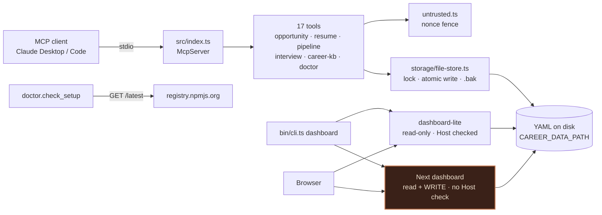
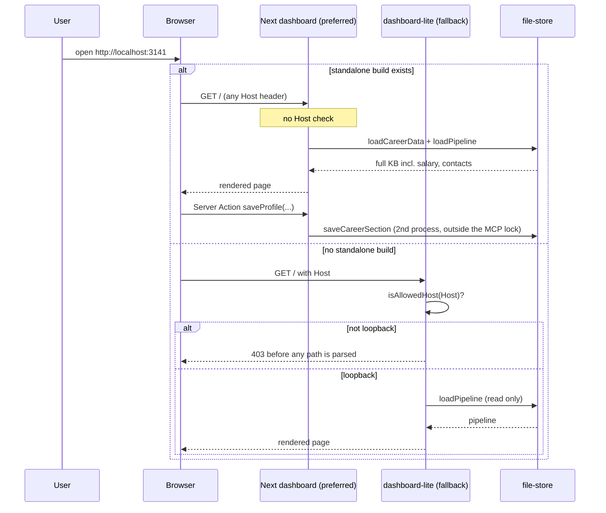
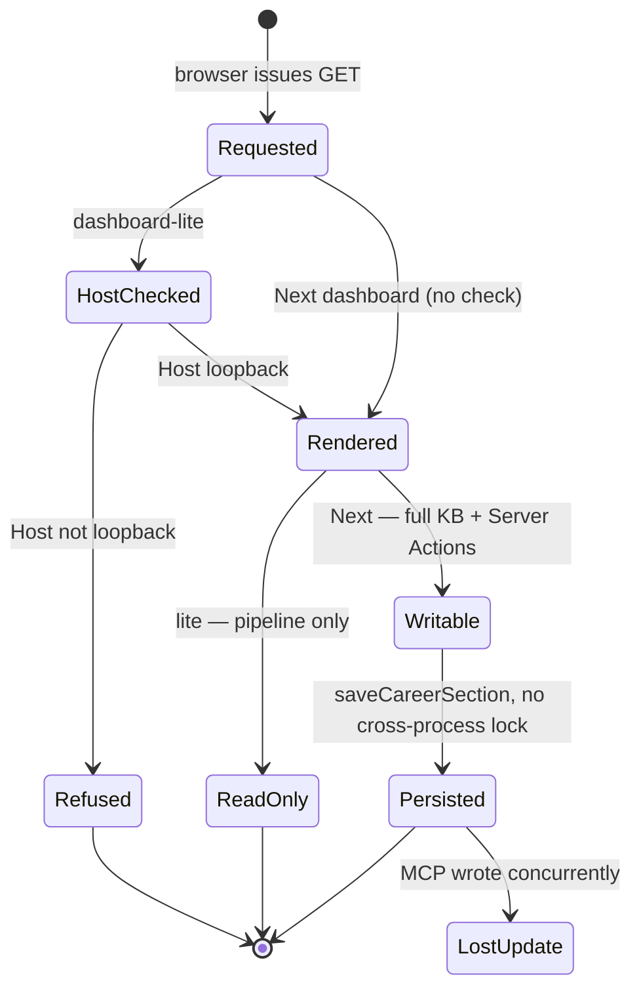
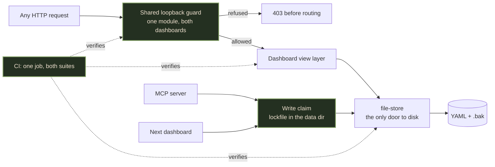
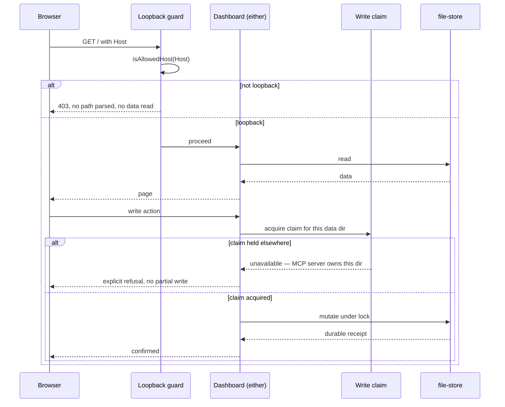
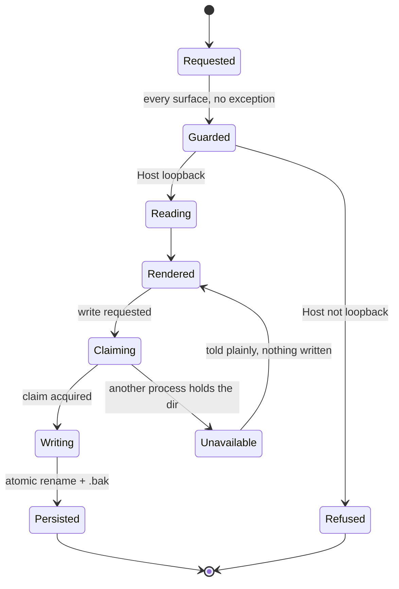

# Career Compass MCP — Final Architecture Audit

> **Consumer:** Ben Schippers, and the next engineer who touches the dashboard or the storage layer.
>
> **Status:** CANONICAL technical-architecture decision surface at `dc823a4` (`main`, 2026-08-22, v2.4.1). This is the sole architecture-risk surface for this repository. It does not supersede the product/readiness question — that belongs to a `stranger-pass`.

## Limits of this pass

- **Inspected:** repository instructions, git baseline and history, `package.json` scripts and `files` allowlist, `manifest.json`, the CI workflow, every non-test file under `src/` and `bin/`, the full `dashboard/` tracked file list plus its server actions, `README.md`, `PRIVACY.md`, and the complete MCP test suite (run, not read-only).
- **Not inspected:** the built Next.js dashboard at runtime (no `dashboard/.next/standalone` build exists in this worktree), npm registry download/usage telemetry, the published `.mcpb` bundle as Claude Desktop actually mounts it, any real user's `~/.career-compass` contents, or a live DNS-rebinding attempt against either dashboard.
- **Not attempted:** no exploit was executed. Every security finding below is a reading of the code plus an absence proven by search, never a demonstrated compromise. Where that distinction matters it is labelled.
- **Evidence labels:** `PROVEN — repository` · `PROVEN — platform` · `EMPIRICAL` · `ESTIMATED` · `PRODUCT DECISION` · `UNKNOWN`.

## Executive verdict

Career Compass is, on the MCP side, one of the most carefully-built things in this estate. The storage layer earns its confidence: fail-closed reads, atomic rename with a Windows retry path, per-file write serialization with the read *inside* the lock, backup retention, an allowlisted section name, and a genuine prompt-injection boundary with a per-call nonce. 335 tests pass and several of them assert *documentation truth* rather than behavior. Almost every invariant in this repo is argued for in a comment before it is enforced in code.

**The defect is not in what was built. It is in where the care stopped.**

The repository contains two dashboards. `src/dashboard-lite/` — the fallback, the one that ships to npm users — carries a sixty-line argument for a DNS-rebinding `Host`-header check and implements it. `dashboard/` — the Next.js one, which `bin/cli.ts:97` **prefers whenever it has been built**, which renders the entire Career KB including salary floor, salary ceiling, and every recruiter contact, and which holds the only write path outside the MCP server — has **no `Host` check, no middleware, and no CI at all**. `npm test`, the command a contributor types, runs only the dashboard's suite; CI runs only the MCP suite. Neither one covers the other. The hardening lives on the surface that needed it least.

**Gate 0 is the release blocker:** the Next dashboard must refuse a non-loopback `Host` before it renders a byte, and it must enter CI. Everything else here is a P2 or below. No rewrite is warranted anywhere; this is a gap in coverage, not a flaw in design.

## 1. Purpose

Give a job-seeker an AI-native career co-pilot that keeps every piece of leverage — history, pipeline, salary floor, interview notes — as plain files on their own disk, so the tool can be inspected, edited by hand, and deleted, rather than trusted.

## 2. What is actually built

An MCP server over stdio (`src/index.ts`) exposing seventeen tools across six domains (opportunity, resume, pipeline, interview, Career KB, install health), plus resources and prompts, registered in `src/server.ts`. State is YAML on disk under `CAREER_DATA_PATH` (default `~/.career-compass`), split into `career/*.yaml` sections, an append-only `career/journal.yaml`, and `pipeline/applications.yaml`.

Two viewers sit on top of that store. `src/dashboard-lite/` is a zero-dependency Node HTTP server that re-reads and re-renders the pipeline on every request; it ships in the npm package and is **read-only**. `dashboard/` is a Next.js 15 app with kanban, analytics, Career KB views, and Storybook; it is **not published** (`package.json:files` excludes it) and only runs from a source clone, but when its standalone build exists the CLI prefers it, and it **writes** through four Server Actions.

`bin/cli.ts` is the single entry point for both: no argument means the MCP server, `dashboard` means one of the two viewers.

## 3. Current architecture

The MCP server is the intended sole writer, and `file-store.ts:65` says so in as many words. The Next dashboard is a second writer in a second OS process, so that invariant is stated but not held. The browser owns presentation only. `registry.npmjs.org` is the one outbound destination in the package, and it is disclosed.

## 4. Reality versus constraints

| Constraint | Current approach | Verdict | Evidence class |
| --- | --- | --- | --- |
| Data never leaves the machine | One unauthenticated GET to the public npm registry, no headers identifying the user, skippable via `checkForUpdates:false`, disclosed in `PRIVACY.md` and asserted by `privacy-claims.test.ts`. | Match, and unusually well policed — a test fails the build if any surface reasserts the old absolute. | `PROVEN — repository` |
| Loopback-only dashboard | `dashboard-lite` binds `127.0.0.1` literally and refuses any non-loopback `Host` (`server.ts:28,84`). The Next dashboard is spawned with `HOSTNAME: "localhost"` (`cli.ts:120`) and checks nothing. | **Mismatch.** Binding is not the defense; the `Host` check is, and it exists on one of two surfaces. | `PROVEN — repository` (absence proven by search across all 90 tracked dashboard files) |
| Single writer per data dir | `withDataLock` serializes read-modify-write per resolved path, in-process, and documents that scope honestly. | **Mismatch.** The repo ships a second writer in a different process (`dashboard/app/onboarding/actions.ts`). | `PROVEN — repository` |
| No durable state lost on a bad write | `.bak` copy before every write, atomic temp+rename, retention 5, fail-closed on corrupt read so an unreadable file is never overwritten. | Match. This is the strongest part of the codebase. | `PROVEN — repository`; 335/335 tests pass |
| Untrusted third-party text cannot issue instructions | Per-call random nonce fence, stated contract before the payload, named source, 20 000-char clamp — applied at all 12 interpolation sites. | Match, with the correct caveat already written into the module: it removes the trivial forgery, it does not make injection impossible. | `PROVEN — repository` |
| The shipped bundle contains no personal data | `npm-pack-leak-guard` and `mcpb-pack-leak-guard` tests run `--dry-run` and assert the allowlist. `pack:guard` runs in CI and in `prepublishOnly`. | Match. | `PROVEN — repository`; CI green |
| Every user-facing surface is tested before publish | CI builds `tsc` and runs `test:mcp` + `pack:guard`. It never builds or tests `dashboard/`. `npm test` runs *only* `dashboard/`. | **Mismatch.** Two suites, each invisible to the other's runner. | `PROVEN — repository` (`.github/workflows/ci.yml`, `package.json:scripts`) |

## 5. Health and tech debt

| Severity | Finding | Exact evidence | Consequence | Containment owner |
| --- | --- | --- | --- | --- |
| **P0** | The preferred dashboard has no DNS-rebinding defense while rendering the entire Career KB. | No `Host` check, no `middleware.ts`, no `isAllowedHost` anywhere in the 90 tracked `dashboard/` files (proven by search). `bin/cli.ts:97` prefers it whenever `dashboard/.next/standalone/…/server.js` exists. `dashboard-lite/server.ts:14-28` argues the exact threat at length. | Any page the user visits can point a hostname it controls at `127.0.0.1` and read salary floor/ceiling, targets, history, and recruiter contacts as same-origin. Exploitability is `UNKNOWN` — not attempted — but the defense the codebase itself names as "the whole defense" is absent. | Gate 0 — host guard parity. |
| **P0** | The same unguarded surface holds four **write** Server Actions. | `dashboard/app/onboarding/actions.ts:11,20,28,37` → `saveCareerSection`. It is the only `"use server"` file in the tree. | Rebinding makes the attacker's page same-origin, so Next's built-in Server-Action origin check (`Origin` vs `Host`) sees a match and does not intervene. A read exposure becomes a write. | Gate 0 — same guard, applied before the action layer. |
| **P1** | `dashboard/` is built by no CI job and tested by no CI job. | `.github/workflows/ci.yml` runs `build:mcp`, `test:mcp`, `pack:guard` only, with a comment explaining the dashboard build is "intentionally skipped". Five test files under `dashboard/` are never executed on `main`. | The surface carrying both P0s is the one surface no automation looks at. A green CI badge covers the half of the repo that was already safe. | Gate 1 — CI covers both halves. |
| **P1** | `npm test` and CI run disjoint suites. | `package.json:scripts.test` = `cd dashboard && npx vitest run`; CI runs `test:mcp`. A contributor typing `npm test` never runs the 335 MCP tests; CI never runs the 5 dashboard ones. | Both greens are honest about a suite and silent about the other. This is the same shape as "green exit-0 = UNVERIFIED". | Gate 1 — `test` runs both, or is renamed. |
| **P1** | The MCP server's single-writer invariant is documented but not held. | `file-store.ts:64-66` — "the MCP server is the single writer for a given data dir. It is not a defense against two servers pointed at one directory." `dashboard/app/onboarding/actions.ts` is a second writer, in a second process, shipped in the same repo. The same class covers a server registered in both Claude Desktop and Claude Code. | Two concurrent read-modify-write cycles on `profile.yaml` interleave; the later rename wins outright and both callers report success. The `.bak` makes it recoverable, not detectable. | Gate 2 — cross-process write claim. |
| **P2** | `HOSTNAME: "localhost"` is passed to the Next standalone server. | `bin/cli.ts:120`. `dashboard-lite/server.ts:124-135` documents that binding the *name* on Windows resolves `::1` first, so the server binds IPv6-only while clients try `127.0.0.1` and get ECONNREFUSED. | The precise bug that was found, diagnosed, and fixed on the lite path is still live on the preferred path. | Gate 0 — bind the literal. |
| **P2** | `savePipeline` is exported unlocked; the "always go through `mutatePipeline`" rule is a comment. | `file-store.ts:373` is public and takes no lock; `file-store.ts:378-398` explains at length why calling it by hand is the bug. | Nothing in the type system stops the next call site from reintroducing the lost-update race the lock exists to prevent. | Gate 2 — make the unsafe path unreachable. |
| **P2** | One raw JSON→`<script>` channel in the lite dashboard has no escaping and no guard. | `dashboard-lite/render.ts:299-300`: `const CHART=${chartData}`. Every other user-controlled value on the page goes through `esc()` (verified at all 8 interpolation sites). `chartData` is safe **only** because its `label` is an enum name and its `color` is from a fixed map. | A one-line future change — putting company names in the chart — turns the page that serves the whole job search into stored XSS on an unauthenticated local origin. No test pins the invariant. | Gate 3 — escape the channel or assert its inputs. |
| **P3** | `openBrowser` spawns through a shell. | `bin/cli.ts:232-233`: `spawn(cmd, [url], { shell: true })`. | The URL is built from a validated integer port, so it is not injectable today. It is one refactor away from being a user-controlled string in a shell. | Gate 3 — drop `shell:true` on the non-Windows paths. |

Nothing above is a design flaw. Every one is a place where a rule the repository already states was applied to one surface and not its neighbour.

## 6. State and dependency inventory

| State / dependency | Current owner | Durable? | Final owner | Migration seam |
| --- | --- | --- | --- | --- |
| Career KB sections (`profile`, `experience`, `skills`, `education`, `projects`, `testimonials`) | `saveCareerSection` via allowlist + lock | Yes — atomic write, `.bak`, fail-closed read | Unchanged | None. Add a cross-process claim only. |
| Career journal (append-only signals) | `appendJournalEntry`, read inside the lock | Yes | Unchanged | None. |
| Pipeline (`applications.yaml`) | `mutatePipeline` for every mutation | Yes, with a dirty check that skips no-op writes | Unchanged | Close the unlocked `savePipeline` export. |
| Backups (`*.<ISO>.bak`, retention 5) | `atomicWriteYaml` → `pruneBackups` | Yes; only the tool's own name pattern is collected | Unchanged | Disclosed in `PRIVACY.md`; no change. |
| Bundled sample (`data/example/`) | Read-only; write is refused; dates shifted at read | N/A | Unchanged | None. |
| Data-dir path | `process.env.CAREER_DATA_PATH`, read at call time | N/A | Unchanged | The lock keys on the resolved path, which is correct. |
| npm latest version | `registry.npmjs.org`, fail-soft, skippable | Provider-owned | Provider | None. |
| Next dashboard build | `dashboard/.next/standalone`, absent from the package | Local build artifact | Unchanged | It gates which dashboard runs — make that decision explicit and tested. |
| Write authority over the data dir | **Split** between the MCP process and the Next process | — | **One claimed writer at a time** | Gate 2. |

## 7. Current critical sequence

The two branches make opposite promises from one command. The branch the CLI prefers is the branch with no guard, and it is the only branch that writes.

## 8. Current lifecycle/state model

`LostUpdate` is reachable and reports success from both writers. `Rendered` is reachable without ever passing `HostChecked`.

## 9. Frontier architecture

One guard module, imported by both dashboards, so a future third viewer inherits the defense instead of re-arguing it. One write claim in the data directory, so "single writer" becomes a fact a second process can observe rather than a sentence in a comment. One CI job that sees both halves of the repository.

## 10. Ideal critical sequence

## 11. Ideal lifecycle/state model

`LostUpdate` is not a reachable state. `Unavailable` is a first-class outcome the user is told about, not a silent overwrite.

## 12. Adversarial reconciliation

Three skeptic passes were run against the raw source: platform/runtime, storage/concurrency, and product/privacy. A contradiction-only re-read reconciled them as follows.

| Delta | Verdict | Evidence | Reconciled change | Residual risk |
| --- | --- | --- | --- | --- |
| D1 — "the Next dashboard is unpublished, so its missing `Host` check is not a real defect" | **MODIFY** | `package.json:files` does exclude it, so npm users never get it. But `bin/cli.ts:97` prefers it in every source clone, which is the author's own daily path and every contributor's. | Keep P0 severity, and state the blast radius precisely: source installs, not npm installs. Do not soften the finding on distribution grounds — the data at risk is the same data. | Whether any third party runs from source is `UNKNOWN`. |
| D2 — "Next.js already blocks cross-origin Server Actions, so the write path is safe" | **REJECT** | Next's check compares `Origin` against `Host`. Under DNS rebinding both are the attacker's hostname, so they match. | Reject the framework as the mitigation. The guard must be a loopback-name allowlist, which is what `dashboard-lite` already implements. | Exact Next 15 Server-Action origin semantics not re-derived from source; `PROVEN — platform` at the level of documented behavior only. |
| D3 — "the in-process lock is insufficient, so it should be replaced with a file lock" | **MODIFY** | `withDataLock` is correct and load-bearing for the single-process case, and its scope comment is honest. The gap is a *second* process, not a broken lock. | Keep the lock exactly as it is; add a claim on top of it. Do not rewrite working concurrency control to fix an adjacent problem. | A cross-process claim has its own failure mode (a stale claim after a crash) — needs a TTL and an override, which is design work, not a patch. |
| D4 — "the `CHART` interpolation is stored XSS" | **REJECT as stated, KEEP as a seam** | `chartData`'s `label` derives from the `ACTIVE` status enum and `color` from `STAGE_COLOR`; no user string reaches it. Verified at `render.ts:296-299`. | Do not report an exploitable XSS — there isn't one. Report the unguarded channel and require a test that pins its inputs. | If a future `esc()` audit relies on reading the file rather than a test, this regresses silently. |
| D5 — "the fail-closed storage layer is over-engineered for a personal tool" | **REJECT** | Every guard in `file-store.ts` cites the concrete incident it came from — 8 concurrent adds leaving 1 application, 224 `.bak` files and 23.7 MB, Windows EPERM on rename, a corrupt profile being overwritten with `{}`. | Retain in full. This is the model the dashboard should be held to, not the other way round. | None. |
| D6 — "CI is fine; the dashboard is a dev-only surface" | **REJECT** | The dev-only surface is the one holding both P0s and the only write path outside the MCP server. "Dev-only" describes distribution, not risk. | CI must build and test `dashboard/`. `npm test` must stop meaning one half of the repo. | Next build time in CI is `ESTIMATED` at 1–3 min; if that is unacceptable, gate it on a path filter rather than dropping it. |

## 13. Canonical migration order

1. **Extract the loopback guard** from `dashboard-lite/server.ts` into one shared module and apply it to the Next dashboard before routing — including before Server Actions. Bind the literal `127.0.0.1`, not the name.
2. **Put `dashboard/` into CI**: build it, run its suite, and make `npm test` run both suites or rename it to something that does not claim to be the test command.
3. **Make the write claim real**: one claim per data dir, acquired by whichever process is writing, with an explicit `unavailable` outcome rather than a silent second writer.
4. **Close the unsafe exports and channels**: `savePipeline` becomes unreachable outside `mutatePipeline`; the `CHART` channel is escaped or its inputs asserted by test.
5. **Drop `shell:true`** from `openBrowser` where the platform does not require it.
6. Only then consider the dashboards' feature parity as a product question.

## 14. The finish line

| Gate | What is finished | Owner | Required evidence | Negative control | Abort/rollback |
| --- | --- | --- | --- | --- | --- |
| **Gate 0 — guard parity** | No dashboard renders a byte, or runs a Server Action, before its `Host` is proven loopback. | Maintainer. | One shared guard module; a test that starts each dashboard and asserts 403 for `Host: evil.example`, `localhost.evil.example`, `[::1]evil`, and a missing header; the literal `127.0.0.1` bound on both paths. | Point a hostname at 127.0.0.1 and request the Next dashboard: it must 403 *before* reading the KB, not after. | Ship `--lite` as the default until the guard lands. |
| **Gate 1 — one CI, both halves** | Every tracked source file is built and tested by the same green. | Maintainer. | CI builds `dashboard` and runs its suite; `npm test` runs both suites; a deliberately broken dashboard test fails `main`. | Break one dashboard test and push: CI must go red. Today it stays green. | Path-filter the dashboard job if build time is the objection — never delete it. |
| **Gate 2 — one claimed writer** | Two processes cannot both believe they own the data dir. | Maintainer. | A claim file in the data dir with a TTL; an integration test running an MCP write and a dashboard write concurrently, asserting one succeeds and one reports `unavailable`. | Run both writers against one dir with the claim disabled and show the lost update; enable it and show the refusal. | Make the Next dashboard read-only — the lite one already is. |
| **Gate 3 — no unguarded channels** | Every path from disk to a browser is escaped, and every unsafe export is unreachable. | Maintainer. | `savePipeline` no longer exported (or renamed `unsafe*` and asserted unused); a test asserting `chartData` contains no user-controlled string. | Put a company name into `chartData` in a test fixture and assert the guard fires. | None needed; these are local changes. |
| **Gate 4 — published truth** | The claims on npm, in `manifest.json`, and in the README match what the code does, for the dashboard as well as the server. | Ben. | `privacy-claims.test.ts` extended to cover the dashboard's own copy; a stated answer to "which dashboard am I running and what can it do". | Reassert an outdated absolute in any surface: the suite must fail. | Revert the copy, not the test. |

## 15. Non-negotiable definition of done

**Engineering:** a surface that can read the Career KB must prove its caller is loopback before it reads. A surface that can write it must hold a claim no other process holds. Every invariant that today exists as a comment — single writer, always-`mutatePipeline`, `chartData`-is-enum-derived — is either enforced by a type or asserted by a test. Every guard has a runnable negative control.

**Product:** the tool's promise is that your career data is yours, on your disk, inspectable. That promise is kept by the storage layer today and is not yet kept by the door. The shortest honest finish-line sentence is: **every surface that can read the salary floor refuses a stranger first, and every surface that can write it knows whether it is allowed to.**

## 16. Residual risks

| Risk | Why it cannot be designed away | Release posture |
| --- | --- | --- |
| Prompt injection through a job posting | The channel is natural language; nothing that can be escaped cannot also be described. | `untrusted.ts` already makes the boundary unambiguous and says plainly that it is not a proof. Keep the nonce, keep the honesty. |
| Plaintext PII at rest, including in `.bak` | The product's whole pitch is plain files the user can read and edit. Encryption would break it. | Disclosed in `PRIVACY.md` including the `.bak` copies; deletion means deleting the directory. `PRODUCT DECISION`, correctly made. |
| A second MCP client registering the same server | Claude Desktop and Claude Code can both hold a config; nothing in MCP prevents it. | Gate 2's claim covers this exactly, and is the reason to build it rather than assume one process. |
| The two dashboards drifting in features and in truth | They are separate implementations by construction — one has no build step. | Keep the *guard* shared even while the views differ; that is the part that must never diverge. |

## 17. Verification record

| Check | Result |
| --- | --- |
| Git baseline / worktree | `dc823a4` on `main`, clean worktree. No files were modified by this audit other than this document. |
| MCP build | `npm run build:mcp` (tsc): clean, exit 0. |
| MCP tests | `npm run test:mcp`: **335 passed, 1 skipped, 38 files**, 6.6 s. |
| Dashboard build | **Not run at audit time** — and, discovered during remediation, **it did not build at all on `main`**. See §18. |
| Dashboard tests | **Not run at audit time.** Seven files, 37 tests; no automation executed them. Now in CI. |
| `Host`-check search | `isAllowedHost` / `middleware` / `headers.get("host")`: **0 hits** across all 90 tracked `dashboard/` files. `PROVEN — repository` by absence. |
| Escaping audit | `render.ts`: all 8 user-controlled interpolations pass through `esc()`; the single exception is the `CHART` script-context channel, whose inputs are enum-derived. |
| Untrusted-fence audit | 12 interpolation sites across 5 tool modules, all via `embedUntrusted`. No raw interpolation of third-party text found. |
| Network egress audit | Exactly one outbound destination in `src/` and `bin/`: `registry.npmjs.org`. Disclosed and test-asserted. |
| Exploitation | **None attempted.** No rebinding, no XSS, no concurrent-write race was executed against a live process. Severities are code-reading plus proven absence. |
| Mermaid parse | All 6 diagrams in this document rendered by `@mermaid-js/mermaid-cli` 11.16.0 without error — see the HTML report. |

## 18. Remediation record — 2026-08-22, branch `gauntlet/close-the-door`

All nine findings closed on one branch, with the negative controls §14 asked for
actually run against running servers rather than asserted in unit tests.

| Finding | Fix | Proof |
| --- | --- | --- |
| P0 — no rebinding defense on the preferred dashboard | Guard extracted to `src/loopback-guard.ts`; `dashboard/proxy.ts` applies it before routing (Next 16 renamed `middleware` → `proxy`). Matcher is `/:path*` with no carve-outs. | **Live probe against the standalone build:** `evil.example` → 403/207 bytes on `/`, `/career`, and `/_next/static/chunks/main.js`; `localhost.evil.example` → 403; loopback → 200 with data. |
| P0 — write path on the same unguarded surface | Same proxy; it runs before Server Actions. | **Live Server-Action POST** to `/onboarding` with `Host: evil.example` → **403**, refused before Next routed it. Loopback POST reached Next (404 on the deliberately bogus action id). |
| P1 — dashboard not built or tested by CI | `ci.yml` gains a `dashboard` job: installs both lockfiles, runs the dashboard suite, and runs `next build`. | CI file rewritten; both suites green locally. |
| P1 — `npm test` and CI ran disjoint suites | `npm test` = `test:mcp && test:dashboard`. | `npm test` runs 362 + 37. |
| P1 — single-writer invariant not held | New `src/storage/write-claim.ts`: an advisory claim per data dir, atomic `wx` create, TTL + dead-pid breaking, taken by every mutation in `file-store.ts`. Both writers labelled so a refusal names what to close. | `write-claim.test.ts` — the negative control asserts a second **live** holder is refused and **the body never runs**. |
| P2 — `HOSTNAME: "localhost"` | `HOSTNAME: LOOPBACK` from the shared module. | Asserted by `loopback-guard.test.ts`. |
| P2 — `savePipeline` exported unlocked | Renamed `savePipelineUnlocked`; `write-lock-truth.test.ts` fails if any non-test source names it. | Truth test green; comment-stripped so it cannot false-positive on prose. |
| P2 — raw JSON → `<script>` channel | `jsonForScript()` neutralises `<`, `>`, U+2028/9; the chart's `innerHTML` build escapes its inputs. | Type-checked; existing dashboard-lite tests green. |
| P3 — `openBrowser` through a shell | `shell:true` dropped; Windows uses the explicit `cmd /c start "" <url>` form. | Code review only; not exercised. |

**One finding the gauntlet missed, found by fixing P1.** `next build` **did not build on `main` at `dc823a4`** — `Can't resolve '../sample-data.js'`, because `src/` is `module: Node16` and Turbopack does not rewrite `.js`→`.ts`. Nothing reported it: CI never built the dashboard, and `bin/cli.ts` silently falls back to the lite dashboard whenever the standalone build is absent, which it always was. So the "preferred" dashboard was unreachable in practice, and the message telling users to build from source led nowhere. Fixed with `turbopack.resolveAlias` entries plus `shared-import-aliases.test.ts`, which fails in seconds naming the exact line to add. **This is the strongest evidence for P1 in the document: a build nobody runs is a build that does not work.**

A second one arrived the same way: once `.next/standalone/` existed, the dashboard suite began collecting its own tests twice — once from source, once from build output. Fixed by an `exclude` in `dashboard/vitest.config.ts`.

**Method note.** The first live probe used `fetch()` with a `host` header override and reported that the guard failed on every request. It had not: `host` is a forbidden header name in undici and the override was silently dropped, so all six requests carried the real authority. Raw `http.request` with `setHost: false` is the only way to put an attacker `Host` on the wire from Node. A negative control that cannot express the attack is not a negative control.

## 19. Post-merge — gaps tested, not reasoned about (2026-08-23)

Both PRs merged (`#37`, `#38`); `main` carries the remediation plus three MCP-native
features. Three items §18 left open were then **tested against real processes**, and two of
them had defects that reading could not have found:

| Gap | Method | Result |
| --- | --- | --- |
| Resource subscriptions deliver | Real stdio client, file edited from outside the server | ✅ External edit → exactly **one** notification on the subscribed URI; unsubscribed silent; `.bak`/`.write-claim` silent. The host half (does the client refresh context) remains the host's choice and is still `UNKNOWN`. |
| `harvest_evidence` without git on PATH | Real server spawned with git removed from `PATH` — the case a Claude Desktop launch actually hits, since the client's environment is not the shell's | ❌ **Defect.** It answered *"is not a git repository"* — a confident, specific, wrong diagnostic sending the user to their repo instead of their PATH. Now `GitUnavailableError`, with its own message. |
| Two processes racing the write claim | **Two real OS processes**, started together, same data dir | ✅ Exactly one wrote; the other refused with a readable reason naming the holder. The external review had only *traced* this class; it is now reproduced and closed. |

A fourth defect surfaced from the same discipline before merge: a **real stdio smoke test**
showed `completion/complete` returning `-32601 Method not found`. MCP completions accept
`ref/prompt` and `ref/resource` — **there is no `ref/tool`** — so a `completable()` tool
argument type-checks, registers, and is never consulted. The capability was not even
advertised. Moved onto the per-application resource template, reconciled onto the existing
`career://pipeline/{id}` rather than added alongside.

**The pattern worth extracting:** four defects, all in code that passed a green suite, all
found by running the real thing instead of reasoning about it. The in-memory transport
proves wiring; only the spawned process proves the product. This is the same lesson as the
audit's own P1 — *a build nobody runs is a build that does not work* — applied one level up.

## Evidence and primary sources

- `src/storage/file-store.ts`, `src/untrusted.ts`, `src/server.ts`, `src/index.ts`, `src/dashboard-lite/{server,render}.ts`, `src/tools/doctor.ts`, `bin/cli.ts`.
- `dashboard/app/onboarding/actions.ts` and the full tracked `dashboard/` file list.
- `.github/workflows/ci.yml`, `package.json`, `manifest.json`, `README.md`, `PRIVACY.md`.
- Test evidence collected 2026-08-22 from this worktree at `dc823a4`.

---

*Filed 2026-08-22 · architectural gauntlet · Claude, home-root session.*
