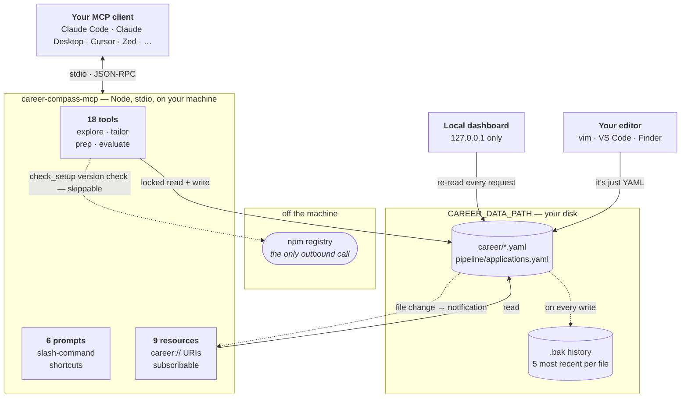
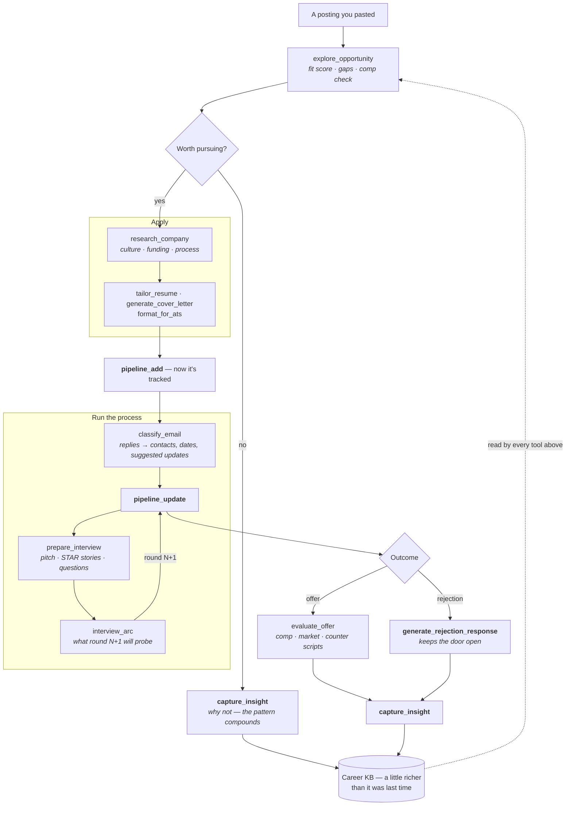
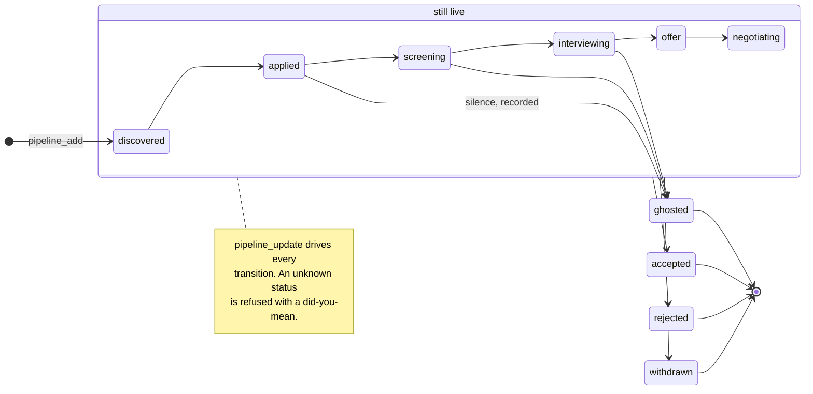
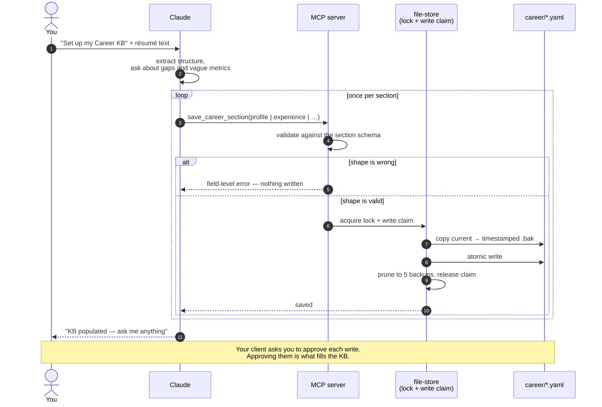
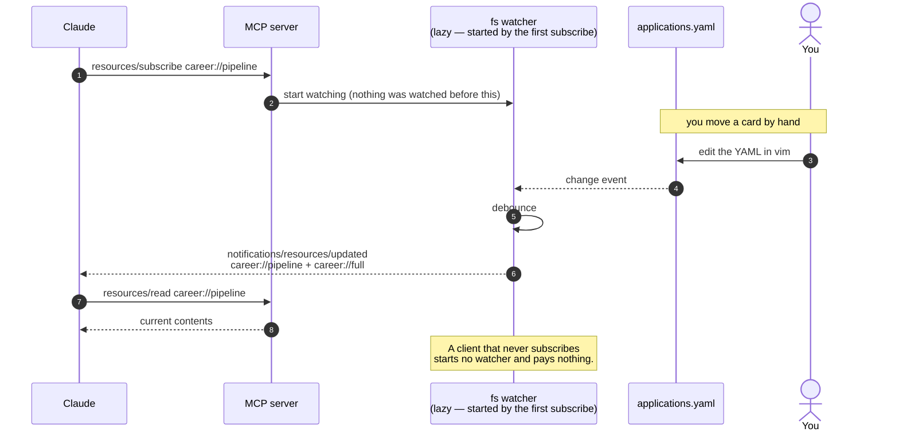
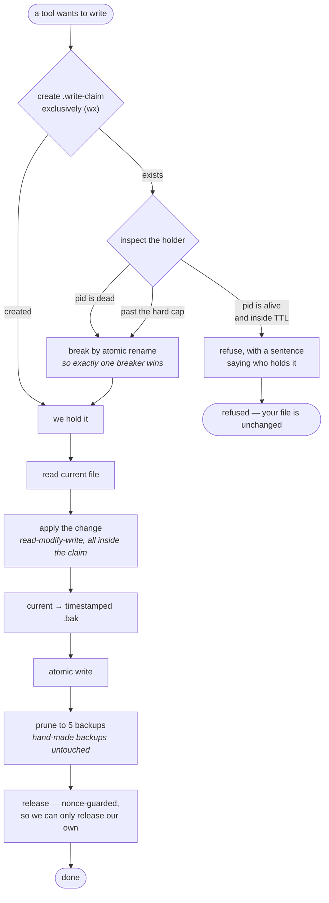

# How Career Compass works

Diagrams of the shipped system, for anyone deciding whether to trust it, extend it, or
debug it. Rendered by GitHub; the [README](../README.md) carries a plain-text version of
the first one, because npmjs.com does not render Mermaid.

For the adversarial version of this — findings, gates, and the defects that got closed —
see [`architecture-audit.md`](architecture-audit.md). This page describes the system as a
user meets it.

---

## 1. The system

One MCP server, one directory of plain YAML, and up to three peers reading it. Nothing is
hosted, and no process owns the data.

The dotted line to npm is the only outbound request the package makes: `check_setup`
asking whether a newer version exists. It carries nothing about you, and
`checkForUpdates: false` never constructs it.

---

## 2. What happens to one job posting

The path a single opportunity takes, and which tool drives each step. Read tools are
plain; **writes** are the ones your client will ask you to approve.

The loop at the bottom is the point. Every outcome — including the rejections — can be
written back as a dated signal, and the next posting is scored against a KB that knows
about it.

---

## 3. An application's states

Ten statuses, six of them "active." `pipeline_view` counts the active ones; the response
and ghost rates are measured only against applications that were actually sent.

`discovered` counts as live work — a role you have found and not yet applied to is on the
board — but it is excluded from response-rate denominators, because a job you never
applied to cannot answer you. `ghosted` is the *recorded* absence of a reply, which is why
it is a state rather than a gap in the data.

---

## 4. Your first conversation

What actually happens between pasting a résumé and having a Career KB.

A write is refused rather than half-applied: validation happens before the file is
touched, and the previous version survives as a `.bak` either way.

---

## 5. Three peers, one directory

The conversation, the dashboard, and your editor all read the same files, and none of them
owns the data. MCP resource subscriptions are what keep the conversation from talking to a
stale copy of your own job search.

The notification is advisory: the server promises to tell you, not that your client will
act on it. Whether the model refreshes its context is the host's call.

---

## 6. Why a write cannot be half-done

Two Career Compass processes can point at one data directory — an MCP server and a
dashboard, or two clients. The claim file is what keeps the second one from interleaving.

The hard cap exists because a crashed writer's pid can be reused by an unrelated process,
which would otherwise wedge the directory permanently. The nonce on release exists so a
process that lost its claim cannot delete the claim that replaced it.

> **One known limit:** on a network or cloud-synced directory, pid liveness means nothing
> across machines and sync can resurrect a deleted claim. Career Compass does not defend
> against that — it is labelled rather than designed away. Keep your data directory local.

---

## Where the code is

| Concern | Files |
|---|---|
| Server assembly | `src/server.ts` |
| Tools | `src/tools/*.ts` — one file per group |
| Resources + subscriptions | `src/resources/career-kb.ts`, `src/resources/live.ts` |
| Prompts | `src/prompts/index.ts` |
| Storage, locking, backups | `src/storage/file-store.ts`, `src/storage/write-claim.ts` |
| Schemas | `src/schemas/career-schema.ts` |
| Shipped dashboard | `src/dashboard-lite/` |
| Loopback enforcement | `src/loopback-guard.ts` |
| CLI | `bin/cli.ts` |
